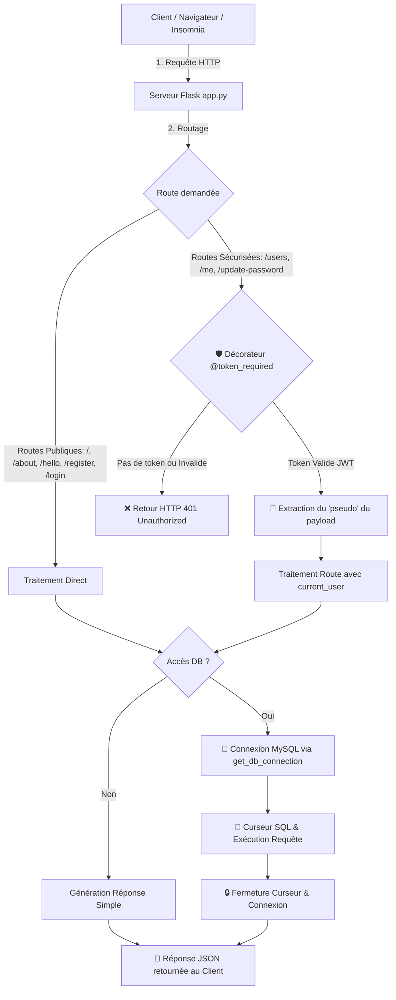

---

title: "API REST avec Flask & MySQL"
module: "R209"
competence: ["Programmer"]
ac_lies: ["AC13.04", "AC13.05"]
techs: ["Python", "Flask", "Jinja2", "Web"]
date: "2026-05-07"
status: "Terminé"
image: ""
---
# 📘 Guide d'Explication Ligne par Ligne : `tp2/app.py`
> **R209 — API REST avec Flask & MySQL — Guide de Code Ligne par Ligne (TP2)** — *Briac Le Meillat (07/05/2026)*

Ce document propose une explication détaillée et structurée de chaque ligne de code de l'application Flask `tp2/app.py`. Il est conçu pour vous aider à comprendre comment fonctionne un serveur API RESTful sécurisé avec JWT (JSON Web Tokens) et interfacé avec une base de données MySQL.

---
project_type: "perso"

## 🏗️ Architecture Globale de l'Application

Afin de mieux appréhender le rôle de chaque ligne de code, voici le schéma conceptuel décrivant comment une requête client (comme une demande d'accès à `/users` ou `/me`) transite à travers les différents composants de notre application :



---
project_type: "perso"

## 📦 1. Imports et Dépendances

Cette section importe l'ensemble des modules standards et des bibliothèques tierces indispensables pour gérer le serveur Web, la base de données, la sécurité par token JWT et les validations de formats.

```python
from flask import Flask, jsonify, request, abort
import mysql.connector as MC
from mysql.connector import Error
import jwt
import datetime
from functools import wraps
import re
```

### 📋 Tableau d'explication des lignes :

| Ligne | Code | Description et Rôle |
| :---: | :--- | :--- |
| **1** | `from flask import Flask, jsonify, request, abort` | Importe la classe principale `Flask` (pour le serveur) et les helpers : `jsonify` (formater du JSON), `request` (accéder aux requêtes entrantes) et `abort` (interrompre la requête avec un code d'erreur). |
| **2** | `import mysql.connector as MC` | Importe le driver MySQL officiel pour Python et lui attribue l'alias plus court `MC` pour simplifier les appels futurs. |
| **3** | `from mysql.connector import Error` | Importe la classe d'exception `Error` spécifique à MySQL, permettant de capturer proprement les erreurs de connexion ou de requête. |
| **4** | `import jwt` | Importe la bibliothèque `PyJWT` qui permet de générer (encoder) et valider (décoder) de manière sécurisée les JSON Web Tokens. |
| **5** | `import datetime` | Importe le module standard Python pour manipuler les dates, crucial pour définir le délai d'expiration des tokens JWT. |
| **6** | `from functools import wraps` | Importe le décorateur `wraps` servant à préserver le nom (`__name__`) et la documentation des fonctions originales lors de l'application de middlewares. |
| **7** | `import re` | Importe la bibliothèque des expressions régulières (Regex), utilisée pour valider la complexité des mots de passe. |

---
project_type: "perso"

## ⚙️ 2. Initialisation de l'Application et Sécurité

Ici, nous instancions notre serveur d'application Flask et définissons la clé de chiffrement nécessaire pour signer de manière cryptographique nos JWT.

```python
app = Flask(__name__)
app.config['SECRET_KEY'] = 'ton_secret_ultra_secure' # Pour JWT
```

### 📋 Tableau d'explication des lignes :

| Ligne | Code | Description et Rôle |
| :---: | :--- | :--- |
| **9** | `app = Flask(__name__)` | Crée l'instance principale de l'application Flask. La variable magique `__name__` indique à Flask son dossier racine afin qu'il puisse localiser les ressources statiques et templates. |
| **10** | `app.config['SECRET_KEY'] = 'ton_secret_ultra_secure'` | Configure une clé secrète globale au sein de l'application. Elle sert de clé de signature pour s'assurer que les tokens JWT retournés par les clients n'ont pas été falsifiés. |

> [!WARNING]
> En production, ne laissez jamais votre clé secrète (`SECRET_KEY`) en clair dans le code. Utilisez des variables d'environnement (`os.environ.get('SECRET_KEY')`) afin de ne pas divulguer cette clé hautement critique sur votre gestionnaire de version (comme GitHub).

---
project_type: "perso"

## 🗄️ 3. Configuration et Gestion de la Base de Données

Cette partie définit les paramètres de connexion à notre serveur de base de données MySQL et implémente une fonction d'ouverture de connexion sécurisée par un bloc `try-except`.

```python
# --- CONFIGURATION DATABASE ---
db_config = {
    'host': 'localhost',
    'user': 'root',
    'password': 'root', # Mets ton mot de passe ici
    'database': 'db_r209_tp2'
}

def get_db_connection():
    try:
        connection = MC.connect(**db_config)
        return connection
    except Error as e:
        print(f"Erreur de connexion : {e}")
        return None
```

### 📋 Tableau d'explication des lignes :

| Ligne | Code | Description et Rôle |
| :---: | :--- | :--- |
| **13** | `db_config = {` | Débute la déclaration d'un dictionnaire contenant les paramètres requis pour la connexion à la base de données. |
| **14** | `    'host': 'localhost',` | Adresse IP ou hôte du serveur MySQL. Ici, la base tourne localement sur votre machine (`localhost`). |
| **15** | `    'user': 'root',` | Nom d'utilisateur utilisé pour s'authentifier auprès de MySQL (ici le superutilisateur `root`). |
| **16** | `    'password': 'root',` | Mot de passe associé à l'utilisateur MySQL. Un commentaire invite à le remplacer par le mot de passe réel. |
| **17** | `    'database': 'db_r209_tp2'` | Nom de la base de données cible qui contient nos tables (notamment `users`). |
| **18** | `}` | Ferme le dictionnaire de configuration. |
| **20** | `def get_db_connection():` | Déclare la fonction utilitaire réutilisable chargée d'établir une liaison avec la base de données. |
| **21** | `    try:` | Ouvre un bloc surveillé (`try`) pour intercepter et gérer proprement d'éventuelles erreurs système ou réseau. |
| **22** | `        connection = MC.connect(**db_config)` | Tente d'ouvrir une session active MySQL en transmettant le dictionnaire de configuration de manière décompressée sous forme d'arguments nommés (`kwargs`). |
| **23** | `        return connection` | En cas de succès, la fonction renvoie immédiatement l'objet de connexion valide pour être exploité par les routes. |
| **24** | `    except Error as e:` | Si une exception de type `mysql.connector.Error` survient, elle est capturée dans la variable `e`. |
| **25** | `        print(f"Erreur de connexion : {e}")` | Affiche le détail précis de l'erreur dans la console système pour aider le développeur au débogage. |
| **26** | `        return None` | Retourne `None` afin d'indiquer de manière explicite aux fonctions appelantes que la connexion a échoué. |

---
project_type: "perso"

## 🛡️ 4. Middleware de Sécurité : Décorateur JWT

Il s'agit d'un intercepteur personnalisé de requêtes HTTP. Ce décorateur vérifie si un token d'authentification valide est fourni dans les en-têtes HTTP de chaque requête ciblant une route protégée.

```python
# --- DECORATEUR DE SECURITE (Middleware) ---
def token_required(f):
    @wraps(f)
    def decorated(*args, **kwargs):
        token = request.headers.get('Authorization') # On attend "Bearer <token>"
        if not token:
            return jsonify({'message': 'Token manquant !'}), 401
        
        try:
            # On retire "Bearer " si présent
            if "Bearer " in token:
                token = token.split(" ")[1]
            data = jwt.decode(token, app.config['SECRET_KEY'], algorithms=["HS256"])
            current_user = data['pseudo']
        except:
            return jsonify({'message': 'Token invalide ou expiré !'}), 401
        
        return f(current_user, *args, **kwargs)
    return decorated
```

### 📋 Tableau d'explication des lignes :

| Ligne | Code | Description et Rôle |
| :---: | :--- | :--- |
| **29** | `def token_required(f):` | Définit la fonction de décoration `token_required` qui prend en paramètre une fonction `f` (la route originale à protéger). |
| **30** | `    @wraps(f)` | Utilise le décorateur `wraps` de Python pour conserver les métadonnées de la fonction d'origine `f` (comme son nom et ses docstrings), évitant des conflits de routage dans Flask. |
| **31** | `    def decorated(*args, **kwargs):` | Déclare la fonction enveloppe interne (`wrapper`) qui interceptera l'appel réel et prend en charge tous les arguments dynamiques. |
| **32** | `        token = request.headers.get('Authorization')` | Récupère le contenu de l'en-tête HTTP standard `Authorization` depuis la requête du client. |
| **33** | `        if not token:` | Vérifie si aucun en-tête `Authorization` n'a été fourni dans la requête. |
| **34** | `            return jsonify({'message': 'Token manquant !'}), 401` | Si absent, interrompt le flux et retourne une erreur JSON indiquant que l'autorisation est requise (HTTP 401 Unauthorized). |
| **36** | `        try:` | Débute un bloc d'interception d'erreurs pour encapsuler le décodage et la validation du token JWT. |
| **37** | `# On retire "Bearer " si présent` | Commentaire explicatif sur la procédure de nettoyage du jeton. |
| **38** | `            if "Bearer " in token:` | Si l'en-tête contient le mot-clé standard `Bearer ` (suivi d'un espace), on s'apprête à nettoyer la chaîne. |
| **39** | `                token = token.split(" ")[1]` | Sépare la chaîne à l'espace et ne conserve que le deuxième élément, qui correspond exactement à la signature du JWT. |
| **40** | `            data = jwt.decode(...)` | Décode le token en utilisant la clé secrète (`SECRET_KEY`) de l'application et l'algorithme de chiffrement symétrique `HS256`. |
| **41** | `            current_user = data['pseudo']` | Extrait du payload décodé l'identifiant (ici le `pseudo`) de l'utilisateur légitime et le stocke. |
| **42** | `        except:` | Capture toute erreur lors du décodage (si le token a été modifié, s'il a expiré, ou si la clé secrète est incorrecte). |
| **43** | `            return jsonify({'message': 'Token invalide ou expiré !'}), 401` | En cas d'erreur de décodage, bloque l'accès en renvoyant une erreur HTTP 401 Unauthorized. |
| **45** | `        return f(current_user, *args, **kwargs)` | Si la validation est réussie, exécute enfin la route originale `f` en lui injectant en premier paramètre le `current_user` authentifié. |
| **46** | `    return decorated` | Retourne la fonction interne enveloppée afin de remplacer la fonction de route originale. |

> [!NOTE]
> **Pourquoi le préfixe "Bearer" ?**
> Le format `Authorization: Bearer <token>` est un standard web (RFC 6750). Le terme *Bearer* signifie littéralement "porteur". Il indique au serveur que l'accès doit être accordé à toute entité qui *porte* et présente ce jeton.

---
project_type: "perso"

## 🌐 5. Routes Publiques de Base

Ces routes basiques fournissent des réponses statiques ou dynamiques et servent principalement à vérifier que le serveur répond correctement sans nécessiter d'authentification.

```python
@app.route('/')
def index():
    return "Serveur Flask Opérationnel"

@app.route('/about')
def about():
    return "Bonjour je suis [Ton Prénom]"

@app.route('/hello/<prenom>')
def hello(prenom):
    return f"Bonjour à toi {prenom} mon ami(e) !"
```

### 📋 Tableau d'explication des lignes :

| Ligne | Code | Description et Rôle |
| :---: | :--- | :--- |
| **50** | `@app.route('/')` | Décorateur Flask associant l'URL racine (`/`) à la fonction qui suit. |
| **51** | `def index():` | Déclare la fonction de vue exécutée pour l'URL `/`. |
| **52** | `    return "Serveur Flask Opérationnel"` | Retourne simplement un message textuel brut confirmant le bon fonctionnement du site. |
| **54** | `@app.route('/about')` | Décorateur Flask configurant la route statique `/about`. |
| **55** | `def about():` | Déclare la fonction de vue associée. |
| **56** | `    return "Bonjour je suis [Ton Prénom]"` | Retourne une chaîne contenant une présentation simple (à modifier avec votre prénom). |
| **58** | `@app.route('/hello/<prenom>')` | Configure une route dynamique. La syntaxe `<prenom>` capture le segment dynamique situé à cet emplacement de l'URL. |
| **59** | `def hello(prenom):` | Déclare la fonction qui reçoit en paramètre la valeur dynamique `prenom` extraite de l'URL. |
| **60** | `    return f"Bonjour à toi {prenom} mon ami(e) !"` | Retourne une chaîne formatée personnalisée intégrant dynamiquement la variable reçue. |

---
project_type: "perso"

## 👥 6. Routes d'Administration et Gestion des Utilisateurs

Ces routes gèrent la recherche, l'affichage et la création (inscription) d'utilisateurs directement dans la table MySQL `users`.

```python
@app.route('/users', methods=['GET'])
@token_required
def get_users(current_user):
    conn = get_db_connection()
    cursor = conn.cursor(dictionary=True)
    cursor.execute("SELECT pseudo FROM users")
    users = cursor.fetchall()
    cursor.close()
    conn.close()
    return jsonify(users)

@app.route('/user/<pseudo>', methods=['GET'])
def get_one_user(pseudo):
    conn = get_db_connection()
    cursor = conn.cursor(dictionary=True)
    cursor.execute("SELECT id, pseudo FROM users WHERE pseudo = %s", (pseudo,))
    user = cursor.fetchone()
    cursor.close()
    conn.close()
    
    if user:
        return jsonify(user)
    return jsonify({'message': 'not found'}), 404

@app.route('/register', methods=['POST'])
def add_user():
    data = request.get_json()
    pseudo = data.get('pseudo')
    password = data.get('password')
    
    if not pseudo or not password:
        return jsonify({'message': 'Paramètres manquants'}), 400
    
    conn = get_db_connection()
    cursor = conn.cursor()
    cursor.execute("INSERT INTO users (pseudo, password) VALUES (%s, %s)", (pseudo, password))
    conn.commit()
    cursor.close()
    conn.close()
    return jsonify({'message': 'Utilisateur créé'}), 201
```

### 📋 Tableau d'explication des lignes :

| Ligne | Code | Description et Rôle |
| :---: | :--- | :--- |
| **64** | `@app.route('/users', methods=['GET'])` | Déclare la route `/users`, restreinte uniquement à la méthode HTTP `GET`. |
| **65** | `@token_required` | Applique le middleware de protection : cette route nécessite obligatoirement un JWT valide. |
| **66** | `def get_users(current_user):` | Déclare la fonction de vue. Elle reçoit automatiquement `current_user` via le décorateur. |
| **67** | `    conn = get_db_connection()` | Établit une liaison SQL active avec la base de données. |
| **68** | `    cursor = conn.cursor(dictionary=True)` | Instancie un curseur SQL configuré pour retourner les lignes sous forme de dictionnaires Python (`colonne: valeur`), ce qui facilite l'exportation en JSON. |
| **69** | `    cursor.execute("SELECT pseudo FROM users")` | Exécute la requête SQL de sélection pour récupérer tous les pseudonymes enregistrés. |
| **70** | `    users = cursor.fetchall()` | Récupère l'intégralité des enregistrements correspondants et les stocke dans une liste. |
| **71** | `    cursor.close()` | Ferme immédiatement le curseur SQL afin de libérer les ressources mémoires du serveur. |
| **72** | `    conn.close()` | Ferme la session de connexion MySQL. |
| **73** | `    return jsonify(users)` | Convertit la liste de dictionnaires en format de réponse standardisé JSON et l'envoie au client. |
| **75** | `@app.route('/user/<pseudo>', methods=['GET'])` | Configure une route dynamique `GET` pour rechercher un profil utilisateur précis par son pseudonyme. |
| **76** | `def get_one_user(pseudo):` | Fonction prenant en paramètre la variable d'URL `<pseudo>`. |
| **77** | `    conn = get_db_connection()` | Ouvre une connexion MySQL. |
| **78** | `    cursor = conn.cursor(dictionary=True)` | Instancie un curseur de type dictionnaire. |
| **79** | `    cursor.execute("SELECT ... WHERE pseudo = %s", (pseudo,))` | Exécute une requête de sélection sécurisée. Le `%s` sert de marqueur pour insérer de façon sûre le paramètre `pseudo` (requête préparée contre les injections SQL). |
| **80** | `    user = cursor.fetchone()` | Récupère uniquement le premier résultat trouvé en base (ou `None` si aucun utilisateur ne correspond). |
| **81** | `    cursor.close()` | Ferme le curseur. |
| **82** | `    conn.close()` | Ferme la connexion active. |
| **84** | `    if user:` | Structure de contrôle vérifiant si un résultat a effectivement été trouvé. |
| **85** | `        return jsonify(user)` | Si l'utilisateur existe, renvoie ses informations au format JSON (HTTP 200 par défaut). |
| **86** | `    return jsonify({'message': 'not found'}), 404` | Sinon, renvoie une erreur JSON avec un code HTTP 404 (Not Found). |
| **88** | `@app.route('/register', methods=['POST'])` | Déclare la route publique d'inscription `/register` accessible uniquement via la méthode `POST`. |
| **89** | `def add_user():` | Déclare la fonction de traitement d'inscription. |
| **90** | `    data = request.get_json()` | Extrait et convertit le corps JSON brut de la requête HTTP en dictionnaire Python `data`. |
| **91** | `    pseudo = data.get('pseudo')` | Récupère de façon sécurisée la valeur associée à la clé `pseudo` (ou `None` si absente). |
| **92** | `    password = data.get('password')` | Récupère la valeur associée à la clé `password`. |
| **94** | `    if not pseudo or not password:` | Effectue un contrôle de présence : bloque la création si un des champs est vide ou absent. |
| **95** | `        return jsonify({'message': 'Paramètres manquants'}), 400` | Si validation échouée, retourne un statut d'erreur HTTP 400 (Bad Request) avec un message. |
| **97** | `    conn = get_db_connection()` | Établit la connexion avec la base de données. |
| **98** | `    cursor = conn.cursor()` | Crée un curseur classique (non-dictionnaire car nous n'avons pas besoin de lire des lignes ici). |
| **99** | `    cursor.execute("INSERT INTO users (pseudo, password) VALUES (%s, %s)", (pseudo, password))` | Insère le nouvel enregistrement de manière sécurisée en liant les paramètres dans la base de données. |
| **100**| `    conn.commit()` | **Très Important !** Valide explicitement la transaction en base de données pour enregistrer définitivement la modification. |
| **101**| `    cursor.close()` | Libère le curseur SQL. |
| **102**| `    conn.close()` | Libère la connexion MySQL active. |
| **103**| `    return jsonify({'message': 'Utilisateur créé'}), 201` | Renvoie une confirmation de création avec un code HTTP 201 (Created). |

> [!IMPORTANT]
> **Pourquoi utiliser `conn.commit()` ?**
> Par défaut, les transactions SQL dans un driver comme MySQL Connector ne sont pas persistées automatiquement. Si vous oubliez d'exécuter `.commit()`, les modifications seront annulées dès que la connexion se fermera, et vos utilisateurs ne seront jamais insérés en base de données.

---
project_type: "perso"

## 🔑 7. Flux d'Authentification (JWT)

Ces deux routes fournissent le cœur du mécanisme d'authentification sans état (stateless) : l'échange d'identifiants contre un jeton cryptographique temporaire, et son utilisation pour identifier l'utilisateur courant.

```python
# --- AUTHENTIFICATION (JWT) ---

@app.route('/login', methods=['POST'])
def login():
    auth = request.get_json()
    # Logique simplifiée pour le TP (Normalement on vérifie en DB ici)
    if not auth or not auth.get('pseudo') or not auth.get('password'):
        return jsonify({'message': 'Login requis'}), 401
    
    # On génère le token
    token = jwt.encode({
        'pseudo': auth.get('pseudo'),
        'exp': datetime.datetime.utcnow() + datetime.timedelta(minutes=30)
    }, app.config['SECRET_KEY'], algorithm="HS256")
    
    return jsonify({'token': token})

@app.route('/me', methods=['GET'])
@token_required
def get_me(current_user):
    return jsonify({'message': f"Tu es connecté(e) sous le pseudo de : {current_user}"})
```

### 📋 Tableau d'explication des lignes :

| Ligne | Code | Description et Rôle |
| :---: | :--- | :--- |
| **107** | `@app.route('/login', methods=['POST'])` | Définit la route de connexion `/login` qui reçoit les identifiants d'un utilisateur par appel `POST`. |
| **108** | `def login():` | Déclare la fonction de vue associée au login. |
| **109** | `    auth = request.get_json()` | Extrait les clés `pseudo` et `password` envoyés au format JSON. |
| **110** | `# Logique simplifiée pour le TP (Normalement on vérifie en DB ici)` | Commentaire rappelant la simplification conceptuelle opérée dans ce TP pour l'authentification. |
| **111** | `    if not auth or not auth.get('pseudo') or not auth.get('password'):` | Vérifie que la charge utile contient bien un pseudo et un mot de passe non vides. |
| **112** | `        return jsonify({'message': 'Login requis'}), 401` | Bloque l'authentification en cas d'omission avec un statut HTTP 401 Unauthorized. |
| **114** | `# On génère le token` | Commentaire indiquant l'étape de construction du token JWT. |
| **115** | `    token = jwt.encode({` | Débute la création du token JWT crypté avec la méthode d'encodage. |
| **116** | `        'pseudo': auth.get('pseudo'),` | Injecte dans le corps du token (*payload*) le pseudonyme de l'utilisateur afin de pouvoir le reconnaître lors des requêtes suivantes. |
| **117** | `        'exp': datetime.datetime.utcnow() + datetime.timedelta(minutes=30)` | Ajoute une réclamation standard (`exp`) définissant la date exacte d'expiration du token (ici 30 minutes dans le futur, calculée en UTC). |
| **118** | `    }, app.config['SECRET_KEY'], algorithm="HS256")` | Signe numériquement le token avec la clé secrète globale et l'algorithme HMAC-SHA256, puis le génère sous forme de chaîne de caractères. |
| **120** | `    return jsonify({'token': token})` | Envoie le token généré au client dans un format d'objet JSON standard. |
| **122** | `@app.route('/me', methods=['GET'])` | Définit la route privée `/me` en accès `GET` permettant de récupérer les informations de son propre profil. |
| **123** | `@token_required` | Protège la route : requiert de fournir le token généré par `/login` dans l'en-tête de la requête. |
| **124** | `def get_me(current_user):` | Reçoit le pseudonyme de l'utilisateur authentifié injecté par le middleware décorateur. |
| **125** | `    return jsonify({'message': f"Tu es connecté(e)..."})` | Retourne une chaîne JSON amicale confirmant l'identité extraite du token. |

---
project_type: "perso"

## 💎 8. Bonus : Mise à Jour Sécurisée du Mot de Passe

Cette route illustre une logique avancée : vérification d'identité par token JWT, validation stricte de la complexité d'un mot de passe par expression régulière, vérification d'historique en base de données, et mise à jour de la table SQL.

```python
# --- BONUS : UPDATE PASSWORD ---

@app.route('/update-password', methods=['PUT'])
@token_required
def update_password(current_user):
    data = request.get_json()
    new_pwd = data.get('password')
    
    # Validation Regex
    # >= 6 et <= 10 chars, 1 Maj, 1 Min, 1 Chiffre
    regex = r"^(?=.*[a-z])(?=.*[A-Z])(?=.*\d)[a-zA-Z\d]{6,10}$"
    
    if not re.match(regex, new_pwd):
        return jsonify({'message': 'Le mot de passe ne respecte pas les critères'}), 400

    conn = get_db_connection()
    cursor = conn.cursor()
    
    # Verif si c'est le même
    cursor.execute("SELECT password FROM users WHERE pseudo = %s", (current_user,))
    old_pwd = cursor.fetchone()[0]
    
    if old_pwd == new_pwd:
        return jsonify({'message': 'Le mot de passe doit être différent de l\'actuel'}), 400
    
    cursor.execute("UPDATE users SET password = %s WHERE pseudo = %s", (new_pwd, current_user))
    conn.commit()
    cursor.close()
    conn.close()
    
    return jsonify({'message': 'Mot de passe mis à jour'})
```

### 📋 Tableau d'explication des lignes :

| Ligne | Code | Description et Rôle |
| :---: | :--- | :--- |
| **129** | `@app.route('/update-password', methods=['PUT'])` | Déclare la route de mise à jour `/update-password` avec la méthode HTTP `PUT` (standard pour les modifications partielles ou totales). |
| **130** | `@token_required` | Protège l'accès à la route : l'utilisateur doit être connecté. |
| **131** | `def update_password(current_user):` | Fonction recevant le pseudo de l'utilisateur actif. |
| **132** | `    data = request.get_json()` | Récupère le payload JSON envoyé par le client. |
| **133** | `    new_pwd = data.get('password')` | Extrait le nouveau mot de passe souhaité. |
| **135** | `# Validation Regex` | Commentaire introduisant le motif d'expression régulière. |
| **136** | `# >= 6 et <= 10 chars, 1 Maj, 1 Min, 1 Chiffre` | Commentaire détaillant les consignes de sécurité appliquées au mot de passe. |
| **137** | `    regex = r"^(?=.*[a-z])(?=.*[A-Z])(?=.*\d)[a-zA-Z\d]{6,10}$"` | Déclare le motif d'expression régulière (Regex). Il impose entre 6 et 10 caractères, au moins une minuscule `[a-z]`, au moins une majuscule `[A-Z]`, et au moins un chiffre `\d`. |
| **139** | `    if not re.match(regex, new_pwd):` | Utilise le module `re` pour valider que le nouveau mot de passe respecte tous ces critères de sécurité. |
| **140** | `        return jsonify({'message': 'Le mot de passe ne respecte pas les critères'}), 400` | Si le mot de passe est trop faible, interrompt l'action et retourne une erreur HTTP 400 Bad Request. |
| **142** | `    conn = get_db_connection()` | Se connecte à la base de données MySQL. |
| **143** | `    cursor = conn.cursor()` | Crée un curseur d'exécution SQL standard. |
| **145** | `# Verif si c'est le même` | Commentaire introduisant la vérification du mot de passe précédent. |
| **146** | `    cursor.execute("SELECT password FROM users WHERE pseudo = %s", (current_user,))` | Exécute une requête SQL pour récupérer le mot de passe actuel de l'utilisateur connecté. |
| **147** | `    old_pwd = cursor.fetchone()[0]` | Extrait la valeur de la colonne de mot de passe depuis le premier tuple renvoyé. |
| **149** | `    if old_pwd == new_pwd:` | Structure conditionnelle vérifiant si le nouveau mot de passe est identique à l'ancien. |
| **150** | `        return jsonify({'message': 'Le mot de passe doit être différent de l\'actuel'}), 400` | Si c'est le même, refuse le changement avec un statut HTTP 400 Bad Request pour des raisons de sécurité. |
| **152** | `    cursor.execute("UPDATE users SET password = %s WHERE pseudo = %s", (new_pwd, current_user))` | Exécute la requête sécurisée de mise à jour (`UPDATE`) en injectant les nouveaux paramètres. |
| **153** | `    conn.commit()` | Valide la modification et la persiste définitivement dans la base de données. |
| **154** | `    cursor.close()` | Ferme le curseur SQL. |
| **155** | `    conn.close()` | Ferme la connexion MySQL active. |
| **157** | `    return jsonify({'message': 'Mot de passe mis à jour'})` | Renvoie un message JSON confirmant la réussite de la modification (HTTP 200 OK). |

---
project_type: "perso"

## 🚀 9. Lancement du Serveur de Développement

Cette section finale indique à l'interpréteur Python comment démarrer l'application si ce script est exécuté directement.

```python
if __name__ == '__main__':
    app.run(host='127.0.0.1', port=5000, debug=True)
```

### 📋 Tableau d'explication des lignes :

| Ligne | Code | Description et Rôle |
| :---: | :--- | :--- |
| **159** | `if __name__ == '__main__':` | Condition standard en Python. Elle vérifie si le script actuel est exécuté directement dans la console (comme `python app.py`) plutôt que d'être simplement importé comme module dans un autre fichier. |
| **160** | `    app.run(host='127.0.0.1', port=5000, debug=True)` | Démarre le serveur web Flask interne sur l'interface locale (`127.0.0.1`), sur le port réseau `5000`, avec le mode de débogage activé (`debug=True`) qui permet le rechargement automatique du code en cas de modification et l'affichage des erreurs système dans la console. |

---
project_type: "perso"

> [!TIP]
> **Le mode Debug de Flask :**
> L'option `debug=True` est d'une valeur inestimable durant le développement local de votre TP :
> 1. Elle redémarre automatiquement votre serveur dès que vous sauvegardez un fichier Python.
> 2. Elle fournit une console interactive de débogage directement utilisable.
> *Cependant, assurez-vous de toujours désactiver cette option (`debug=False`) lorsque vous déployez votre application dans un environnement de production réel.*
