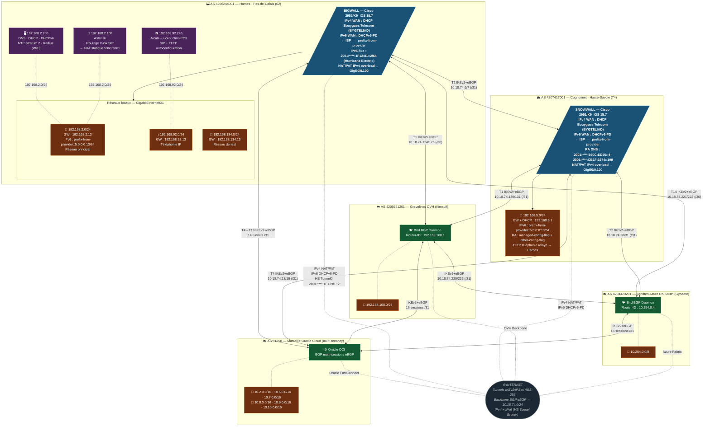
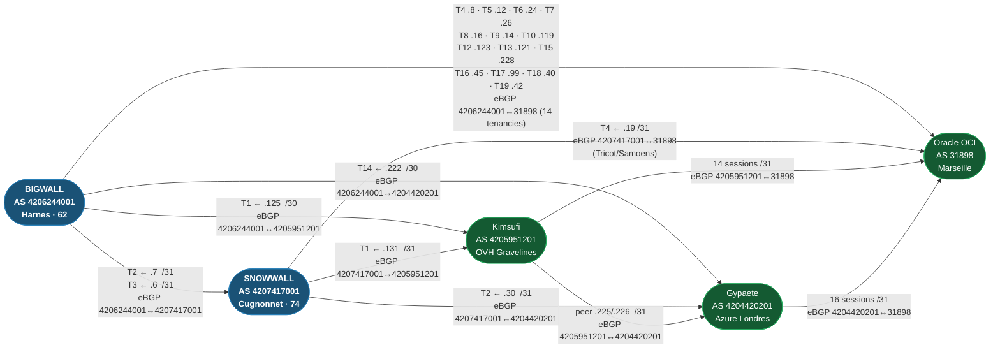
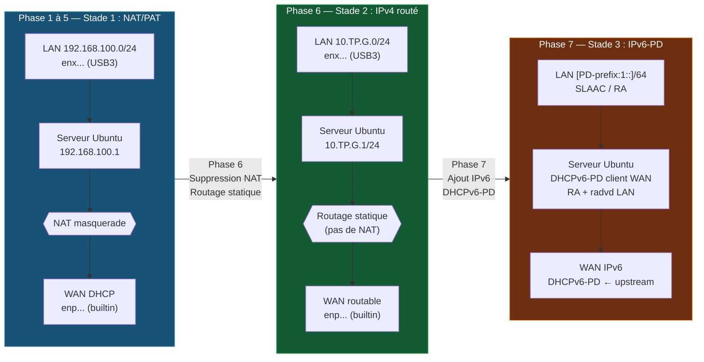

# Configuration d'un Serveur de TPME
## Ubuntu Server 24.04 LTS · De NAT vers un réseau routé IPv4/IPv6

---

## Table des matières

1. [Contexte — L'infrastructure LESMUIDS](#1-contexte--linfrastructure-lesmuids)
2. [Rappels théoriques](#2-rappels-théoriques)
3. [Architecture cible et progression pédagogique](#3-architecture-cible-et-progression-pédagogique)
4. [Phase 1 — Support bootable (30 min)](#phase-1--préparation-du-support-bootable-30-min)
5. [Phase 2 — Installation Ubuntu (1h)](#phase-2--installation-ubuntu-server-2404-lts-1h)
6. [Phase 3 — Configuration réseau (30 min)](#phase-3--configuration-réseau-avec-netplan-30-min)
7. [Phase 4 — Services TPME de base (4h)](#phase-4--services-tpme-de-base-4h)
8. [Phase 5 — Tests de validation (30 min)](#phase-5--tests-de-validation-30-min)
9. [Phase 6 — Transition vers IPv4 routé (1h)](#phase-6--transition-vers-ipv4-routé-1h)
10. [Phase 7 — IPv6 avec délégation de préfixe (1h)](#phase-7--ipv6-avec-délégation-de-préfixe-1h)
11. [Guide de dépannage](#guide-de-dépannage)
12. [Annexes](#annexes)

---

## 1. Contexte — L'infrastructure LESMUIDS

**LESMUIDS est l'infrastructure réseau réelle de notre réseau**, interconnectant deux sites physiques en France et une infrastructure cloud multi-fournisseurs. Ce n'est pas un réseau de simulation : les configurations Cisco et Bird présentées dans ce TP sont celles des routeurs de production.

### 1.1 Les deux sites physiques

| Site | Localisation | Routeur | AS |
|------|-------------|---------|-----|
| **Harnes** | Pas-de-Calais (62) — Hauts-de-France | BIGWALL · Cisco 2951/K9 | 4206244001 |
| **Cugnonnet** | Haute-Savoie (74) — Auvergne-Rhône-Alpes | SNOWWALL · Cisco 2951/K9 | 4207417001 |

Les deux sites sont interconnectés entre eux et au cloud via des **tunnels IPSec/IKEv2 AES-256** établis sur l'internet public, transportant du **BGP eBGP** (External BGP). Cette architecture permet à l'université de disposer d'un réseau privé unifié sur l'ensemble de ses sites — exactement comme une grande entreprise multisites le ferait.

### 1.2 Topologie complète — Sites, LANs et connectivité IPv6



### 1.3 Matrice des tunnels IKEv2 — détail par tunnel



> Les adresses de peering `10.18.74.x` sont des adresses **privées RFC 1918**, internes aux interfaces de tunnel IPSec. Les adresses IP publiques WAN ont été omises conformément à la politique de sécurité de notre réseau.

### 1.4 Lien avec ce TP — Pourquoi étudier cette architecture ?

L'infrastructure LESMUIDS illustre **trois stades d'évolution** que vous allez reproduire dans ce TP :

```
Stade 1 — NAT/PAT (box ADSL/fibre)           ← État initial du TP
  Chaque site sort sur internet avec une seule IP publique dynamique
  Les réseaux privés (192.168.x.0/24) ne sont pas routables depuis l'extérieur
  C'est le fonctionnement actuel de BIGWALL et SNOWWALL pour leurs LANs

Stade 2 — Réseau routé IPv4                  ← Phase 6 du TP
  Les sous-réseaux privés deviennent routables (annoncés en BGP dans LESMUIDS)
  Chaque site dispose de subnets joignables depuis les autres sites sans NAT
  La connexion BIGWALL ↔ SNOWWALL fonctionne sans NAT entre eux

Stade 3 — IPv6 avec délégation de préfixe    ← Phase 7 du TP
  L'ISP (Bouygues Telecom) délègue un préfixe IPv6 à chaque routeur (DHCPv6-PD)
  Le Cisco sub-délègue un /64 à chaque LAN via prefix-from-provider
  Les clients s'auto-configurent en SLAAC
  NAT IPv6 = inutile (chaque appareil a une adresse globale unique)
```

### 1.5 IPv6 dans LESMUIDS — Ce que font déjà BIGWALL et SNOWWALL

Les deux Cisco ont une connectivité IPv6 **dual-stack** :

| Mécanisme | BIGWALL (Harnes) | SNOWWALL (Cugnonnet) |
|-----------|-----------------|----------------------|
| **DHCPv6-PD ISP** | `ipv6 dhcp client pd prefix-from-provider` sur GigE0/0.100 | idem |
| **Préfixe WAN** | `prefix-from-provider ::F:0:0:0:13/64` | `prefix-from-provider ::F:0:0:0:1/64` |
| **Préfixe LAN** | `prefix-from-provider ::5:0:0:0:13/64` sur GigE0/1 | idem |
| **RA aux clients** | `ipv6 nd managed-config-flag` + `ipv6 nd other-config-flag` | idem |
| **DNS IPv6 (RA)** | (non configuré explicitement sur GigE0/1) | `2001:****:560C:ED95::4` · `2001:****:CB1F:1974::100` |
| **IPv6 fixe (backup)** | `2001:****:1F12:81::2/64` via Tunnel0 Hurricane Electric | `2001:****:C848:400::1/64` via GigE0/2 |

> **Hurricane Electric (HE)** est un opérateur proposant gratuitement des tunnels IPv6-over-IPv4 (6in4). Il permet aux sites ne disposant pas d'IPv6 natif de leur ISP d'avoir une connectivité IPv6 fixe. BIGWALL utilise ce tunnel comme connexion IPv6 statique de secours.

---

## 2. Rappels théoriques

### 2.1 Ubuntu 24.04 LTS — Concepts fondamentaux

#### 2.1.1 Versions LTS et cycle de support

**LTS = Long Term Support** (Support à Long Terme). Canonical publie deux types de versions :

| Type | Fréquence | Support standard | Support étendu (ESM) |
|------|-----------|-----------------|----------------------|
| Ordinaire (ex: 23.10) | Tous les 6 mois | 9 mois | — |
| **LTS (ex: 24.04)** | Tous les 2 ans | **5 ans** (→ 2029) | **10 ans** avec Ubuntu Pro (→ 2034) |

Versions LTS actuelles (publiées en avril des années paires) :

```
Ubuntu 20.04 LTS  "Focal Fossa"     ████████████████░░░░  2020 → 2025 (ESM → 2030)
Ubuntu 22.04 LTS  "Jammy Jellyfish" ████████████████████  2022 → 2027 (ESM → 2032)
Ubuntu 24.04 LTS  "Noble Numbat"    ████████████████████  2024 → 2029 (ESM → 2034)  ◄ nous
Ubuntu 26.04 LTS  (à venir)                               2026 → 2031 (ESM → 2036)
```

> Pour un serveur de production, on choisit **toujours** une version LTS.

#### 2.1.2 Relation Ubuntu / Debian — Différences avec l'univers RPM

Ubuntu est **directement dérivée de Debian** (Debian Unstable + paquets Canonical). Cette filiation a des conséquences très concrètes :

| Action | Debian / Ubuntu | RHEL / Fedora |
|--------|----------------|---------------|
| Format de paquet | `.deb` | `.rpm` |
| Gestionnaire bas niveau | `dpkg` | `rpm` |
| Gestionnaire haut niveau | `apt` | `dnf` (RHEL ≥8) · `yum` (RHEL ≤7) |
| Mettre à jour | `apt update && apt upgrade` | `dnf update` |
| Config réseau | `netplan` → networkd | `nmcli` · `nmtui` |
| Pare-feu front-end | `ufw` · `nftables` | `firewalld` · `nftables` |

Malgré des commandes différentes, les deux familles partagent le même substrat : systemd, nftables/iptables, noyau Linux.

---

### 2.2 UEFI vs BIOS — Démarrage sécurisé

| Caractéristique | BIOS | UEFI |
|-----------------|------|------|
| Table de partition | MBR (max 2 To, 4 partitions) | **GPT** (max 9,4 Zo, 128 partitions) |
| Démarrage sécurisé | Non | **Secure Boot** (signatures cryptographiques) |
| Interface firmware | Texte 16 bits | Graphique 32/64 bits |
| Partition de boot | MBR (512 octets) | **ESP** FAT32 (≥ 100 Mo) |
| Bootloader Ubuntu | GRUB2 | **GRUB2 EFI** · systemd-boot |

#### Secure Boot

Vérifie la signature cryptographique du bootloader avant exécution. Ubuntu 24.04 supporte le Secure Boot via un **shim signé par Microsoft** :

```
Firmware UEFI → vérifie → shim.efi (signé Microsoft)
                              ↓ vérifie
                         grub.efi (signé Canonical)
                              ↓ vérifie
                         vmlinuz (noyau)  → démarrage ✓
```

---

### 2.3 NAT, routage et IPv6 — Les trois stades réseau

#### 2.3.1 NAT/PAT (masquerade) — Stade 1

Le NAT (Network Address Translation) traduit les adresses privées RFC 1918 vers une adresse publique unique. Le PAT (Port Address Translation), ou masquerade, distingue les flux par leur port source :

```
Client 192.168.100.10:54321 ──→ srv:masquerade ──→ [IP-WAN]:54321 ──→ 8.8.8.8:53
Client 192.168.100.11:54322 ──→ srv:masquerade ──→ [IP-WAN]:54322 ──→ 8.8.8.8:53
                                  ↑ table de connexions (conntrack)
```

**Avantages :** simple, fonctionne avec n'importe quelle IP WAN dynamique.
**Inconvénients :** les clients ne sont pas joignables depuis l'extérieur, complexité pour les services entrants (SIP, jeux…), pas scalable.

#### 2.3.2 Réseau routé IPv4 — Stade 2

Dans un réseau routé, chaque sous-réseau possède des adresses **routables** et les routeurs intermédiaires savent où les envoyer. Pas de translation d'adresses.

```
Réseau salle : 10.TP.0.0/16  ←  Routeur salle (enseignant)
  ├── Groupe 1 : 10.TP.1.0/24  ←  Serveur groupe 1  (route statique ou OSPF)
  ├── Groupe 2 : 10.TP.2.0/24  ←  Serveur groupe 2
  └── Groupe N : 10.TP.N.0/24  ←  Serveur groupe N

Tous les sous-réseaux se joignent directement (ping, SSH, etc.)
```

Le serveur Ubuntu remplace son rôle de passerelle NAT par celui de **routeur** (ip_forward=1 sans masquerade).

#### 2.3.3 IPv6 avec délégation de préfixe (DHCPv6-PD) — Stade 3

En IPv6, **NAT est inutile** : l'espace d'adressage est suffisamment large (2¹²⁸ adresses) pour attribuer des adresses **globales uniques** à chaque interface, exactement comme dans LESMUIDS.

**Mécanisme DHCPv6-PD (Prefix Delegation) :**

```
ISP / routeur upstream
    │
    │  DHCPv6-PD : "donne-moi un préfixe"
    ▼
[Serveur Ubuntu — interface WAN]
    │  Reçoit ex: 2001:db8:1234:5600::/56
    │
    │  Sub-délègue un /64 par LAN
    ▼
[Interface LAN — enx...]
    │  Préfixe LAN : 2001:db8:1234:5601::/64
    │  Router Advertisement (RA) → SLAAC
    ▼
[Clients — autoconfiguration SLAAC]
    Adresse : 2001:db8:1234:5601:[EUI-64 ou privacy]/64
    Passerelle : fe80::... (link-local du serveur)
    DNS : via RA (RDNSS) ou DHCPv6 (option M)
```

**SLAAC (Stateless Address AutoConfiguration)** : un client IPv6 génère son adresse en combinant le préfixe /64 reçu par RA et son identifiant d'interface (EUI-64 ou adresse aléatoire pour la vie privée). Aucun serveur DHCP n'est nécessaire.

---

## 3. Architecture cible et progression pédagogique

### 3.1 Vue d'ensemble de la progression



### 3.2 Plan d'adressage — Les trois stades

| Stade | Interface WAN (builtin) | Interface LAN (USB3) | Clients LAN | Accès internet |
|-------|------------------------|---------------------|-------------|----------------|
| **1 — NAT** | DHCP salle (x.x.x.x) | 192.168.100.1/24 | 192.168.100.10→200 | Masquerade |
| **2 — Routé** | 10.TP.0.1/24 (static) | 10.TP.G.1/24 | 10.TP.G.10→200 | Route statique |
| **3 — IPv6** | DHCPv6-PD upstream | [prefix:1::1]/64 | SLAAC auto | Routage natif |

> `TP` = numéro de session, `G` = numéro de groupe (attribué par l'enseignant)

### 3.3 Matériel

| Élément | Détails |
|---------|---------|
| Machine-serveur | PC avec NIC builtin + port USB3 libre |
| Adaptateur USB3-Ethernet | USB 3.0 → RJ45 Gigabit (chipsets r8152/ax88179, natifs Linux) |
| Clé USB | ≥ 8 Go, USB3 de préférence |
| ISO Ubuntu Server 24.04 | `ubuntu-24.04.x-live-server-amd64.iso` |
| Switch réseau | 5 à 8 ports pour le LAN privé |
| PC clients (tests) | 1 à 2 PC pour valider DHCP, DNS, NAT, routage, SLAAC |

---

## Phase 1 — Préparation du support bootable (30 min)

### Étape 1.1 — Téléchargement et vérification de l'ISO

```bash
# Téléchargez depuis https://ubuntu.com/download/server
# ubuntu-24.04.x-live-server-amd64.iso

# Vérifiez l'intégrité (comparez avec le hash officiel de la page de téléchargement)
sha256sum ubuntu-24.04.x-live-server-amd64.iso
```

### Étape 1.2 — Création de la clé USB bootable UEFI

**Méthode A — balenaEtcher (multiplateforme, recommandée)**

```
1. https://etcher.balena.io  →  téléchargez et ouvrez
2. Flash from file  →  sélectionnez l'ISO
3. Select target   →  choisissez la clé USB
4. Flash!          →  attendez la vérification
```

**Méthode B — Rufus (Windows)**

```
Schéma de partition : GPT  (obligatoire pour UEFI)
Système de fichiers : Large FAT32
Mode image : ISO Image  →  DÉMARRER
```

**Méthode C — `dd` (Linux/macOS)**

```bash
lsblk                          # Identifiez votre clé (sdX)
sudo dd if=ubuntu-24.04.x-live-server-amd64.iso \
        of=/dev/sdX bs=4M status=progress oflag=sync
```

> ⚠️ `dd` ne demande pas de confirmation. Une erreur sur le périphérique cible efface tout sans retour possible.

### Étape 1.3 — Configuration UEFI

1. Accédez au BIOS/UEFI (`F2`, `F10`, `DEL` ou `SUPPR`)
2. Mode de démarrage : **UEFI** (désactivez CSM/Legacy)
3. Boot Order : placez la clé USB en premier
4. Si Secure Boot bloque : désactivez-le temporairement

---

## Phase 2 — Installation Ubuntu Server 24.04 LTS (1h)

### Étape 2.1 — Installateur Subiquity

| Écran | Choix recommandé |
|-------|-----------------|
| Langue | English (messages système plus facilement googlabes) |
| Mise à jour installateur | Acceptez si proposée |
| Clavier | fr · fr |
| Type d'installation | **Ubuntu Server** (pas minimized) |
| Réseau | Interface builtin → DHCP · Interface USB3 → pas de config |
| Proxy | Vide (sauf si requis par la salle) |

### Étape 2.2 — Partitionnement

```
Use an entire disk  →  LVM activé (bonne pratique)
Partitions créées automatiquement :
  /boot/efi   512 Mo  FAT32     ← partition ESP (UEFI)
  /boot         1 Go  ext4
  /            reste  ext4 (dans LVM)
```

> ⚠️ Efface tout le disque sélectionné.

### Étape 2.3 — Compte administrateur

| Champ | Valeur |
|-------|--------|
| Hostname | `srv-tpme` |
| Utilisateur | `tpme` (ou votre login étudiant) |
| Mot de passe | ≥ 10 caractères, mixte |
| OpenSSH Server | ✅ Cochez cette option |

### Étape 2.4 — Première mise à jour

```bash
sudo apt update && sudo apt upgrade -y
sudo reboot
```

---

## Phase 3 — Configuration réseau avec Netplan (30 min)

### Étape 3.1 — Identifier les interfaces

```bash
ip link show
# lo     : loopback
# enp... : NIC builtin  → WAN
# enx... : USB3-Ethernet → LAN privé (nom = enx + adresse MAC)
```

### Étape 3.2 — Fichier Netplan (stade 1 — NAT)

```bash
sudo nano /etc/netplan/50-cloud-init.yaml
```

```yaml
network:
  version: 2
  renderer: networkd
  ethernets:
    enp3s0:                        # ← Adaptez : interface builtin (WAN)
      dhcp4: true
      dhcp6: false
      optional: true

    enx001122334455:               # ← Adaptez : interface USB3 (LAN)
      dhcp4: false
      addresses:
        - 192.168.100.1/24
      nameservers:
        addresses: [127.0.0.1]
```

```bash
sudo netplan try    # Teste 30s avec rollback automatique si KO
sudo netplan apply
ip addr show
```

> ⚠️ YAML : indentation strictement en espaces (jamais de tabulations).

---

## Phase 4 — Services TPME de base (4h)

```bash
sudo apt install -y isc-dhcp-server bind9 bind9utils chrony nftables
```

### 4.1 Clé TSIG (partagée DHCP ↔ DNS pour le DDNS)

```bash
sudo -i
tsig-keygen -a hmac-sha256 dhcpupdate > /etc/dhcp/ddns-keys.conf
cp /etc/dhcp/ddns-keys.conf /etc/bind/ddns-keys.conf
chmod 640 /etc/bind/ddns-keys.conf && chown root:bind /etc/bind/ddns-keys.conf
exit
```

### 4.2 Serveur DHCP v4 — `isc-dhcp-server`

```bash
# Interface d'écoute
sudo nano /etc/default/isc-dhcp-server
```
```ini
INTERFACESv4="enx001122334455"    # ← Adaptez
```

```bash
sudo nano /etc/dhcp/dhcpd.conf
```
```
option domain-name "tp.lesmuids.local";
option domain-name-servers 192.168.100.1;
default-lease-time 600;
max-lease-time 7200;
ddns-update-style interim;
authoritative;

include "/etc/dhcp/ddns-keys.conf";

zone tp.lesmuids.local. {
    primary 127.0.0.1;
    key dhcpupdate;
}
zone 100.168.192.in-addr.arpa. {
    primary 127.0.0.1;
    key dhcpupdate;
}

subnet 192.168.100.0 netmask 255.255.255.0 {
    range 192.168.100.10 192.168.100.200;
    option routers 192.168.100.1;
    option subnet-mask 255.255.255.0;
    option domain-name-servers 192.168.100.1;
    option ntp-servers 192.168.100.1;
    ddns-domainname "tp.lesmuids.local.";
    ddns-rev-domainname "in-addr.arpa.";
}
```

```bash
sudo systemctl enable --now isc-dhcp-server
```

### 4.3 Serveur DNS — `bind9` avec DDNS

```bash
sudo nano /etc/bind/named.conf.options
```
```
options {
    directory "/var/cache/bind";
    recursion yes;
    allow-recursion { 192.168.100.0/24; 127.0.0.1; };
    forwarders { 1.1.1.1; 8.8.8.8; };
    dnssec-validation auto;
    listen-on { 192.168.100.1; 127.0.0.1; };
    listen-on-v6 { ::1; };           /* Prêt pour IPv6 (phase 7) */
    allow-query { 192.168.100.0/24; 127.0.0.1; ::1; };
};
```

```bash
sudo nano /etc/bind/named.conf.local
```
```
include "/etc/bind/ddns-keys.conf";

zone "tp.lesmuids.local" {
    type master;
    file "/var/lib/bind/db.tp.lesmuids.local";
    allow-update { key dhcpupdate; };
};
zone "100.168.192.in-addr.arpa" {
    type master;
    file "/var/lib/bind/db.192.168.100";
    allow-update { key dhcpupdate; };
};
```

```bash
sudo nano /var/lib/bind/db.tp.lesmuids.local
```
```dns
$TTL 300
@ IN SOA srv-tpme.tp.lesmuids.local. admin.tp.lesmuids.local. (
    1 300 60 3600 300 )
@        IN NS  srv-tpme.tp.lesmuids.local.
srv-tpme IN A   192.168.100.1
```

```bash
sudo nano /var/lib/bind/db.192.168.100
```
```dns
$TTL 300
@ IN SOA srv-tpme.tp.lesmuids.local. admin.tp.lesmuids.local. (
    1 300 60 3600 300 )
@  IN NS  srv-tpme.tp.lesmuids.local.
1  IN PTR srv-tpme.tp.lesmuids.local.
```

```bash
sudo chown bind:bind /var/lib/bind/db.tp.lesmuids.local /var/lib/bind/db.192.168.100
sudo named-checkconf
sudo named-checkzone tp.lesmuids.local /var/lib/bind/db.tp.lesmuids.local
sudo systemctl enable --now bind9
```

### 4.4 Serveur NTP — `chrony` stratum 3

```bash
sudo nano /etc/chrony/chrony.conf
```
```
pool 2.fr.pool.ntp.org iburst
pool ntp.ubuntu.com iburst
allow 192.168.100.0/24
local stratum 10
```

```bash
sudo systemctl enable --now chrony
chronyc sources -v    # Vérification : cherchez la colonne Stratum
chronyc tracking      # Doit afficher Stratum ≤ 3
```

### 4.5 NAT/PAT masquerade — `nftables`

```bash
# ip_forward (routage entre interfaces)
echo 'net.ipv4.ip_forward=1' | sudo tee /etc/sysctl.d/99-ip-forward.conf
sudo sysctl -p /etc/sysctl.d/99-ip-forward.conf
```

```bash
sudo nano /etc/nftables.conf
```
```
#!/usr/sbin/nft -f
flush ruleset

table ip nat {
    chain postrouting {
        type nat hook postrouting priority srcnat; policy accept;
        # Masquerade : LAN → WAN
        oifname "enp3s0" ip saddr 192.168.100.0/24 masquerade
        #         ↑ interface WAN builtin — ADAPTEZ
    }
}

table ip filter {
    chain forward {
        type filter hook forward priority filter; policy drop;
        ct state established,related accept
        # LAN → internet autorisé
        iifname "enx001122334455" oifname "enp3s0" ct state new accept
        #         ↑ LAN USB3                ↑ WAN — ADAPTEZ LES DEUX
    }
}
```

```bash
sudo systemctl enable --now nftables
sudo nft list ruleset    # Vérification
```

> ⚠️ Adaptez **impérativement** les noms d'interfaces (`enp3s0` et `enx001122334455`).

---

## Phase 5 — Tests de validation (30 min)

```bash
# ── DHCP ──────────────────────────────────────────────────────────
# Sur le client :
ip addr show                         # 192.168.100.x/24 ?
ip route show                        # passerelle 192.168.100.1 ?
# Sur le serveur :
sudo cat /var/lib/dhcp/dhcpd.leases  # Baux actifs

# ── DNS ───────────────────────────────────────────────────────────
dig srv-tpme.tp.lesmuids.local @192.168.100.1
nslookup 192.168.100.1 192.168.100.1         # Inverse
nslookup google.com 192.168.100.1            # Forwarder externe
# Après bail DHCP d'un client :
dig @192.168.100.1 <nom-client>.tp.lesmuids.local

# ── NTP ───────────────────────────────────────────────────────────
chronyc sources -v      # Sources avec * = synchronisé
chronyc tracking        # Stratum ≤ 3

# ── NAT/Internet ──────────────────────────────────────────────────
ping -c4 8.8.8.8        # Routage IP via NAT
ping -c4 google.com     # DNS + NAT simultanément
curl -s -o /dev/null -w "%{http_code}" https://ubuntu.com  # HTTPS
```

### Tableau de validation — Stade 1

| # | Test | ✓/✗ |
|---|------|-----|
| 1 | Client reçoit IP DHCP 192.168.100.x | |
| 2 | Client reçoit passerelle 192.168.100.1 | |
| 3 | `dig srv-tpme.tp.lesmuids.local` résout | |
| 4 | Résolution inverse de 192.168.100.1 | |
| 5 | DDNS : enregistrement A du client créé automatiquement | |
| 6 | `chronyc sources` : au moins une source `*` | |
| 7 | Stratum affiché ≤ 3 | |
| 8 | `ping 8.8.8.8` depuis le client | |
| 9 | `nslookup google.com` via 192.168.100.1 (forwarder) | |
| 10 | `curl https://ubuntu.com` depuis le client | |

---

## Phase 6 — Transition vers IPv4 routé (1h)

> **Pré-requis :** L'enseignant a configuré le routeur de salle avec une route vers votre sous-réseau et vous a communiqué votre bloc IP et la passerelle de salle.

Cette phase reproduit ce que fait l'infrastructure LESMUIDS entre Harnes et Cugnonnet : les deux sites se joignent en IPv4 **sans NAT**, via des routes annoncées en BGP. Dans la salle, on simplifie avec des routes statiques.

### 6.1 Ce qui change

| Stade 1 (NAT) | Stade 2 (Routé) |
|--------------|-----------------|
| IP WAN : DHCP aléatoire | IP WAN : adresse **statique** attribuée (10.TP.0.G/24) |
| IP LAN : 192.168.100.1/24 | IP LAN : **10.TP.G.1/24** (bloc attribué par l'enseignant) |
| Clients LAN : 192.168.100.x | Clients LAN : **10.TP.G.x** (routables depuis la salle) |
| Internet : masquerade | Internet : **route statique** vers passerelle de salle |
| Autres groupes : non joignables | Autres groupes : **directement joignables** (ping, SSH…) |

### 6.2 Mise à jour du plan d'adressage

L'enseignant vous communique (à adapter) :

```
Bloc LAN attribué à votre groupe  : 10.TP.G.0/24
Adresse serveur sur le LAN        : 10.TP.G.1/24
Adresse serveur sur le WAN        : 10.TP.0.G/24
Passerelle de salle (WAN)         : 10.TP.0.254
```

### 6.3 Mise à jour Netplan

```bash
sudo nano /etc/netplan/50-cloud-init.yaml
```

```yaml
network:
  version: 2
  renderer: networkd
  ethernets:
    enp3s0:                          # WAN — IP statique attribuée
      dhcp4: false
      addresses:
        - 10.TP.0.G/24               # ← Remplacez TP et G
      routes:
        - to: default
          via: 10.TP.0.254           # ← Passerelle de salle
      nameservers:
        addresses: [1.1.1.1, 8.8.8.8]

    enx001122334455:                 # LAN — nouveau bloc
      dhcp4: false
      addresses:
        - 10.TP.G.1/24              # ← Remplacez TP et G
      nameservers:
        addresses: [127.0.0.1]
```

```bash
sudo netplan apply
ip addr show
ping 10.TP.0.254       # Passerelle de salle joignable ?
ping 8.8.8.8           # Internet joignable ?
```

### 6.4 Suppression du masquerade — nftables

```bash
sudo nano /etc/nftables.conf
```

Remplacez le contenu par :

```
#!/usr/sbin/nft -f
flush ruleset

# Stade 2 : plus de NAT, juste du filtrage de routage
table ip filter {
    chain forward {
        type filter hook forward priority filter; policy drop;
        ct state established,related accept
        # LAN → internet (et vers autres groupes)
        iifname "enx001122334455" ct state new accept
        # Retour vers le LAN depuis n'importe quelle source
        oifname "enx001122334455" ct state established,related accept
    }
}
```

```bash
sudo nft -f /etc/nftables.conf
sudo nft list ruleset
```

### 6.5 Mise à jour des services

```bash
# DHCP : mettre à jour le subnet et les options
sudo nano /etc/dhcp/dhcpd.conf
```

Remplacez la section subnet :

```
# Supprimez l'ancien subnet 192.168.100.0 et ajoutez :
subnet 10.TP.G.0 netmask 255.255.255.0 {
    range 10.TP.G.10 10.TP.G.200;
    option routers 10.TP.G.1;
    option subnet-mask 255.255.255.0;
    option domain-name-servers 10.TP.G.1;
    option ntp-servers 10.TP.G.1;
    ddns-domainname "tp.lesmuids.local.";
    ddns-rev-domainname "in-addr.arpa.";
}
```

```bash
# DNS : mettre à jour listen-on et allow-query
sudo nano /etc/bind/named.conf.options
# Remplacez 192.168.100.1 → 10.TP.G.1

# NTP : mettre à jour allow
sudo nano /etc/chrony/chrony.conf
# Remplacez 192.168.100.0/24 → 10.TP.G.0/24

# Redémarrez tous les services
sudo systemctl restart isc-dhcp-server bind9 chrony nftables
```

### 6.6 Tests de validation — Stade 2

```bash
# Joignabilité inter-groupes (sans NAT)
ping 10.TP.AUTRE_GROUPE.1           # Serveur d'un autre groupe
ssh tpme@10.TP.AUTRE_GROUPE.1       # SSH direct entre groupes

# Vérification absence de NAT
sudo nft list ruleset | grep masquerade   # Ne doit rien afficher

# Traceroute : doit montrer le vrai chemin routé
traceroute 8.8.8.8
```

---

## Phase 7 — IPv6 avec délégation de préfixe (1h)

> **Pré-requis :** L'enseignant a configuré le routeur de salle avec la connectivité IPv6 (native ISP ou tunnel Hurricane Electric comme BIGWALL) et le support DHCPv6-PD.

Cette phase reproduit exactement ce que font BIGWALL et SNOWWALL : obtenir un préfixe IPv6 de l'opérateur par DHCPv6-PD, puis distribuer des adresses aux clients du LAN via SLAAC.

### 7.1 Installation des outils IPv6

```bash
sudo apt install -y wide-dhcpv6-client radvd
```

| Outil | Rôle |
|-------|------|
| `wide-dhcpv6-client` (dhcp6c) | Client DHCPv6-PD : demande un préfixe au routeur upstream (comme `ipv6 dhcp client pd` sur le Cisco) |
| `radvd` | Envoie des Router Advertisements aux clients LAN (comme `ipv6 nd ra interval 10` sur le Cisco) |

### 7.2 Mise à jour Netplan — IPv6 sur WAN

```bash
sudo nano /etc/netplan/50-cloud-init.yaml
```

Ajoutez les directives IPv6 sur l'interface WAN :

```yaml
network:
  version: 2
  renderer: networkd
  ethernets:
    enp3s0:                          # WAN
      dhcp4: false
      dhcp6: true                    # Active le client DHCPv6
      ipv6-privacy: false            # Désactive les adresses temporaires (on veut une IP stable)
      accept-ra: true                # Accepte les Router Advertisements de l'upstream
      addresses:
        - 10.TP.0.G/24
      routes:
        - to: default
          via: 10.TP.0.254
      nameservers:
        addresses: [127.0.0.1]

    enx001122334455:                 # LAN
      dhcp4: false
      dhcp6: false                   # C'est nous qui servons les RA, pas l'upstream
      addresses:
        - 10.TP.G.1/24
      nameservers:
        addresses: [127.0.0.1]
```

```bash
sudo netplan apply
# Vérifiez que l'interface WAN a une adresse IPv6 globale (2xxx::/...)
ip -6 addr show enp3s0
```

### 7.3 Configuration du client DHCPv6-PD

Le client `dhcp6c` demande un préfixe (PD = Prefix Delegation) au routeur upstream et l'assigne à l'interface LAN — exactement comme le `ipv6 dhcp client pd prefix-from-provider` du Cisco.

```bash
sudo nano /etc/wide-dhcpv6/dhcp6c.conf
```

```
# Interface WAN : demande d'un préfixe délégué
interface enp3s0 {         # ← Adaptez : interface WAN
    send ia-pd 0;          # Demande une Identity Association pour Prefix Delegation
};

# Description de la délégation : sous-préfixe /64 vers l'interface LAN
id-assoc pd 0 {
    prefix-interface enx001122334455 {   # ← Adaptez : interface LAN
        sla-id 1;          # Identifiant du sous-réseau (1 = premier /64)
        sla-len 8;         # Longueur ajoutée au préfixe délégué :
                           # si l'upstream donne un /56, sla-len=8 donne un /64
                           # si l'upstream donne un /48, sla-len=16 donne un /64
    };
};
```

```bash
sudo systemctl enable --now wide-dhcpv6-client
# Vérifiez que l'interface LAN a reçu un préfixe IPv6 :
ip -6 addr show enx001122334455
# Vous devez voir une adresse 2xxx::/64 (globale) en plus de la fe80:: (link-local)
```

> **Parallèle avec LESMUIDS :** `dhcp6c` fait exactement la même chose que `ipv6 dhcp client pd prefix-from-provider` sur BIGWALL/SNOWWALL. La directive `sla-id` correspond à `::5:0:0:0:13` dans `ipv6 address prefix-from-provider ::5:0:0:0:13/64`.

### 7.4 Router Advertisement — `radvd`

`radvd` envoie des **Router Advertisements (RA)** sur le LAN pour que les clients se configurent automatiquement en **SLAAC** — équivalent des commandes `ipv6 nd ra interval`, `ipv6 nd managed-config-flag` et `ipv6 nd other-config-flag` sur le Cisco.

```bash
sudo nano /etc/radvd.conf
```

```
interface enx001122334455 {   # ← Adaptez : interface LAN
    AdvSendAdvert on;         # Envoie des RA périodiquement
    MinRtrAdvInterval 30;     # Intervalle min entre RA (secondes)
    MaxRtrAdvInterval 100;    # Intervalle max entre RA
    AdvManagedFlag off;       # M=0 : adresses via SLAAC (pas DHCPv6 stateful)
    AdvOtherConfigFlag on;    # O=1 : autres options (DNS) via DHCPv6 stateless

    # Préfixe à annoncer : ::/64 = "utilisez le préfixe de cette interface"
    prefix ::/64 {
        AdvOnLink on;          # Le préfixe est sur ce lien
        AdvAutonomous on;      # Les clients peuvent s'auto-configurer (SLAAC)
        AdvRouterAddr on;      # Inclure l'adresse du routeur dans le préfixe
    };

    # Annonce les serveurs DNS via RDNSS (RFC 6106)
    # L'adresse link-local fe80:: du serveur fonctionne toujours
    RDNSS fe80::1 {            # ← Remplacez par la fe80:: réelle de votre interface LAN
        AdvRDNSSLifetime 300;
    };
};
```

```bash
# Récupérez l'adresse link-local de votre interface LAN
ip -6 addr show enx001122334455 | grep fe80
# Exemple : fe80::e654:e8ff:fe12:3456/64  →  RDNSS fe80::e654:e8ff:fe12:3456

# Mettez à jour /etc/radvd.conf avec cette adresse, puis :
sudo systemctl enable --now radvd
sudo radvd --configtest   # Vérifie la syntaxe
```

### 7.5 DNS — Ajout du support IPv6

Bind9 gère nativement IPv4 et IPv6. Il faut juste lui dire d'écouter sur l'adresse IPv6 du LAN et d'accepter les requêtes depuis les clients IPv6.

```bash
sudo nano /etc/bind/named.conf.options
```

Mettez à jour `listen-on-v6` et `allow-query` :

```
options {
    ...
    listen-on   { 10.TP.G.1; 127.0.0.1; };
    listen-on-v6 { ::1; };    /* Après phase 7, ajoutez l'adresse IPv6 du LAN */
    allow-query  { 10.TP.G.0/24; 127.0.0.1; ::1;
                   fe80::/10;               /* Link-local — clients SLAAC */
                   /* Ajoutez ici le préfixe /64 délégué une fois connu */
                 };
    ...
};
```

```bash
sudo systemctl reload bind9
```

### 7.6 Tests de validation — Stade 3

```bash
# ── Sur le serveur ─────────────────────────────────────────────────
ip -6 addr show                   # Interfaces WAN et LAN doivent avoir des 2xxx::
ip -6 route show                  # Route par défaut IPv6 via upstream
journalctl -u wide-dhcpv6-client  # Confirme la réception du préfixe délégué

# ── Sur un PC client (après reconnexion réseau) ───────────────────
ip -6 addr show                   # Adresse SLAAC 2xxx:: auto-configurée
ip -6 route show                  # Route par défaut via fe80:: du serveur
ping6 2606:4700:4700::1111        # Cloudflare IPv6 (test connectivité globale)
curl -6 https://ipv6.google.com   # Test HTTP IPv6

# ── Vérification du mécanisme SLAAC ──────────────────────────────
# Le client doit s'être configuré WITHOUT serveur DHCPv6 stateful
# Adresse = préfixe/64 + EUI-64 (basé sur MAC) ou random privacy address
```

### Tableau de validation — Stade 3

| # | Test | ✓/✗ |
|---|------|-----|
| 11 | Interface WAN a une adresse IPv6 globale | |
| 12 | Interface LAN a un préfixe /64 délégué | |
| 13 | Client reçoit une adresse SLAAC (2xxx::/64) | |
| 14 | Client a une route par défaut IPv6 (via fe80:: du serveur) | |
| 15 | `ping6 2606:4700:4700::1111` depuis le client | |
| 16 | `curl -6 https://ipv6.google.com` depuis le client | |
| 17 | DNS résout les noms en IPv4 ET IPv6 (AAAA si disponible) | |

---

## Guide de dépannage

### Commandes essentielles

| Symptôme | Commandes de diagnostic |
|----------|------------------------|
| Service ne démarre pas | `sudo systemctl status <svc>` · `sudo journalctl -u <svc> -n 50` |
| DHCP ne distribue pas | `journalctl -u isc-dhcp-server` · vérifier INTERFACESv4 · vérifier subnet vs interface IP |
| DNS ne répond pas | `sudo named-checkconf` · `dig @127.0.0.1 srv-tpme.tp.lesmuids.local` |
| Pas de NAT | `sysctl net.ipv4.ip_forward` · `sudo nft list ruleset` |
| Pas de routage IPv4 | `ip route show` · `ping passerelle` · vérifier nftables policy |
| Interface USB absente | `ip link` · `lsusb` · `dmesg \| grep -E 'r8152\|ax88\|enx'` |
| DDNS KO | Vérifier droits `bind:bind` sur `/var/lib/bind/` · TSIG identique dans les deux fichiers |
| NTP stratum 10 | Réseau WAN OK ? · `ping 2.fr.pool.ntp.org` · `chronyc sources -v` |
| DHCPv6-PD : pas de préfixe | `journalctl -u wide-dhcpv6-client` · routeur upstream supporte-t-il PD ? |
| SLAAC : pas d'adresse IPv6 | `radvd --configtest` · `ip -6 addr show LAN` (LAN a-t-elle un /64 ?) · `tcpdump -i enx... icmp6` |
| radvd refuse de démarrer | Interface doit avoir une adresse IPv6 avant que radvd démarre · vérifier ordre systemd |

### Erreurs fréquentes

- **Netplan / YAML :** tabulations → espaces uniquement ; `sudo netplan try` rejette et rollback
- **dhcpd :** le subnet doit correspondre exactement au réseau de l'interface d'écoute
- **bind9 :** `/var/lib/bind/` doit appartenir à `bind:bind` pour que le DDNS écrive
- **nftables :** `ip_forward=0` → aucune règle nftables ne peut router (même sans masquerade)
- **TSIG incohérent :** les fichiers ddns-keys.conf dans `/etc/dhcp/` et `/etc/bind/` doivent être **identiques**
- **radvd + wide-dhcpv6-client :** radvd doit démarrer **après** que dhcp6c a assigné le préfixe sur l'interface LAN ; si radvd démarre en premier, l'interface n'a pas encore de préfixe global → ajouter `After=wide-dhcpv6-client.service` dans un override systemd
- **Adresse RDNSS fe80:: :** la link-local change à chaque redémarrage si elle est dérivée du MAC (stable) mais pensez à vérifier après remplacement du matériel

---

## Annexes

### Annexe A — Résumé des paquets et services

| Paquet | Service | Ports | Stade | Rôle |
|--------|---------|-------|-------|------|
| `isc-dhcp-server` | `isc-dhcp-server` | UDP 67/68 | 1→3 | DHCPv4 + DDNS |
| `bind9` | `bind9` (named) | UDP/TCP 53 | 1→3 | DNS autorité + récursif |
| `bind9utils` | — | — | 1→3 | named-checkconf, dig, nsupdate |
| `chrony` | `chrony` | UDP 123 | 1→3 | NTP stratum 3 |
| `nftables` | `nftables` | — | 1→3 | Pare-feu / NAT (stade 1) / filtrage (stades 2-3) |
| `wide-dhcpv6-client` | `wide-dhcpv6-client` | UDP 546/547 | 3 | Client DHCPv6-PD (demande préfixe upstream) |
| `radvd` | `radvd` | ICMPv6 | 3 | Router Advertisements SLAAC vers LAN |

### Annexe B — Parallèle LESMUIDS / TP

| Fonction | LESMUIDS (BIGWALL/SNOWWALL) | Serveur Ubuntu TP |
|----------|-----------------------------|-------------------|
| DHCPv4 clients | `ip dhcp pool` Cisco IOS | `isc-dhcp-server` |
| DNS | Serveur dédié 192.168.2.200 | `bind9` |
| NTP | Serveur dédié 192.168.2.200 stratum 2 | `chrony` stratum 3 |
| NAT/PAT IPv4 | `ip nat inside source route-map … overload` | `nftables` masquerade |
| **DHCPv6-PD client** | `ipv6 dhcp client pd prefix-from-provider` | `wide-dhcpv6-client` |
| **Sub-délégation /64 LAN** | `ipv6 address prefix-from-provider ::5:0:0:0:13/64` | `dhcp6c` sla-id 1 |
| **RA vers clients** | `ipv6 nd ra interval 10` + flags M/O | `radvd` |
| **DNS IPv6 dans RA** | `ipv6 nd ra dns server 2001:...` | `RDNSS` dans radvd.conf |
| IPv6 fixe backup | Hurricane Electric Tunnel0 `2001:****:1F12:81::2/64` | (hors scope TP) |

### Annexe C — Rappels systemd

```bash
sudo systemctl start    <svc>   # Démarre immédiatement
sudo systemctl stop     <svc>   # Arrête
sudo systemctl restart  <svc>   # Redémarre
sudo systemctl reload   <svc>   # Recharge la config sans redémarrer
sudo systemctl enable   <svc>   # Active le démarrage automatique au boot
sudo systemctl status   <svc>   # État + derniers logs
sudo journalctl -u <svc> -f     # Suit les logs en temps réel
sudo journalctl -u <svc> -n 50  # 50 dernières lignes
```

### Annexe D — Correspondance tunnels IKEv2 / BGP LESMUIDS

| Tunnel | Routeur | Destination | IP locale /31 | AS distant |
|--------|---------|-------------|--------------|------------|
| T2 (BIGWALL) | Harnes | Cugnonnet | 10.18.74.7 | 4207417001 |
| T1 (BIGWALL) | Harnes | OVH Kimsufi | 10.18.74.125 | 4205951201 |
| T14 (BIGWALL) | Harnes | Azure Gypaete | 10.18.74.222 | 4204420201 |
| T4→T19 (BIGWALL) | Harnes | Oracle OCI ×14 | 10.18.74.8–.99 | 31898 |
| T3 (SNOWWALL) | Cugnonnet | Harnes | 10.18.74.6 | 4206244001 |
| T1 (SNOWWALL) | Cugnonnet | OVH Kimsufi | 10.18.74.131 | 4205951201 |
| T2 (SNOWWALL) | Cugnonnet | Azure Gypaete | 10.18.74.30 | 4204420201 |
| T4 (SNOWWALL) | Cugnonnet | Oracle (Tricot) | 10.18.74.19 | 31898 |

> Toutes les adresses publiques WAN sont omises. Les adresses `10.18.74.x` sont des adresses privées RFC 1918 internes aux tunnels IPSec.

