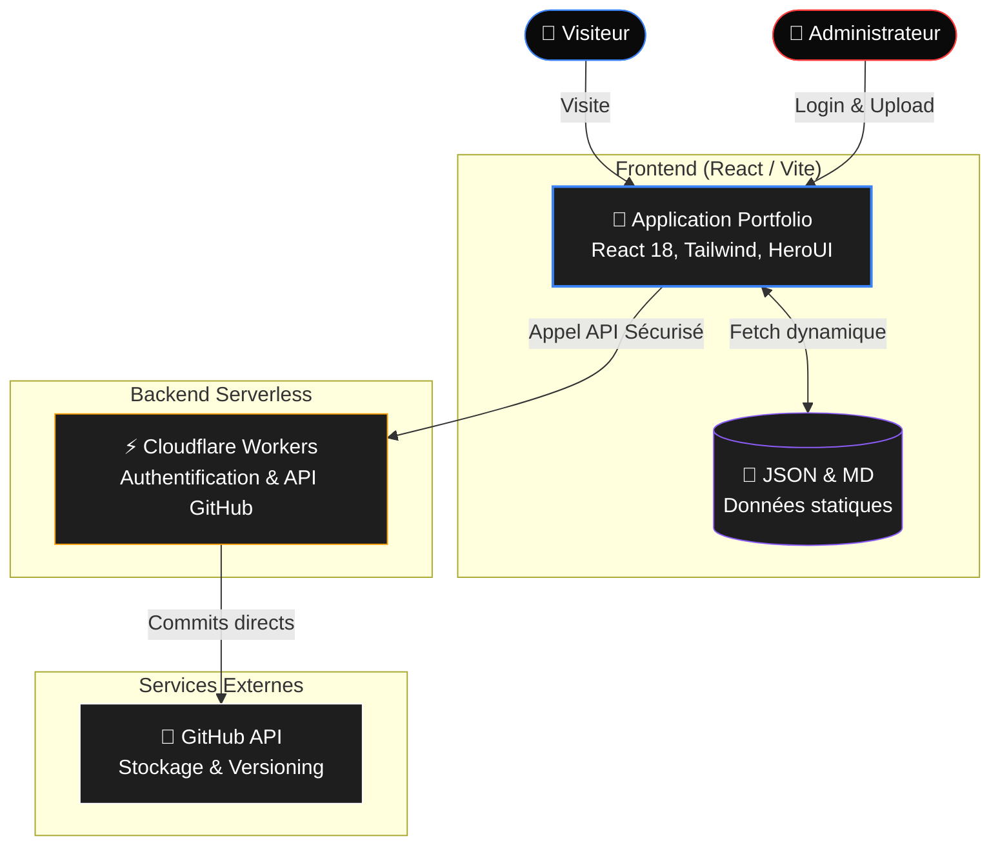
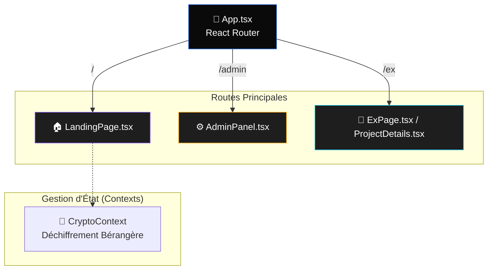
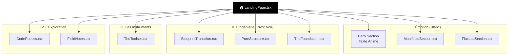

# Architecture du Site - Briac Le Meillat Portfolio

Ce document agit comme une **carte de navigation technique**. Inspiré de l'approche MVC et du modèle C4, il vous permet de comprendre la structure globale du site, puis de "zoomer" jusqu'à la ligne de code exacte responsable de l'affichage d'un élément ou d'une donnée sur la Landing Page.

---

## 🌍 Niveau 1 : Vue Système (Global)
L'architecture globale montre comment les différentes briques technologiques interagissent. Le site fonctionne principalement en "CSR" (Client-Side Rendering) avec un backend serverless pour les tâches d'administration.

---

## 🏗️ Niveau 2 : Vue Conteneur (L'Application React)
Comment le flux de données circule-t-il dans l'application au niveau du routage et des composants principaux ?

---

## 🔍 Niveau 3 : Exploration Profonde de la Landing Page
La Landing Page est structurée en "Mouvements". Voici la décomposition exacte de ses composants visuels.

---

## 📍 Niveau 4 : Traçabilité MVC (Où est le code ? D'où vient la donnée ?)

Ce tableau vous sert de "GPS" dans le code. Pour chaque morceau visible à l'écran, vous trouverez le composant responsable, la source des données, et les lignes exactes gérant le "Fetch" (récupération) et le "Render" (affichage).

| Section Visuelle | Composant (La "Vue") | Source (Le "Modèle") | Logique Fetch ("Controller") | Ligne de Rendu (JSX) |
| :--- | :--- | :--- | :--- | :--- |
| **Navbar (Menu principal)** | [Navbar.tsx](file:///Users/blemeill/Development/briac-le-meillat/briac-le-meillat/src/Components/Navbar.tsx) | *Statique (Hardcodé)* | N/A | Ligne 32 |
| **Bandeau Défilant (News)** | [Newsbar.tsx](file:///Users/blemeill/Development/briac-le-meillat/briac-le-meillat/src/Components/Newsbar.tsx) | *State interne (Timer)* | `useEffect` L.11 | Ligne 31 |
| **Texte "Manifeste"** | [ManifestoSection.tsx](file:///Users/blemeill/Development/briac-le-meillat/briac-le-meillat/src/Components/ManifestoSection.tsx) | *Constantes `wordsPartX`* | Variables L.53-55 | Ligne 72 |
| **Projets Réseaux (Flux Lab)** | [FluxLabSection.tsx](file:///Users/blemeill/Development/briac-le-meillat/briac-le-meillat/src/Components/FluxLabSection.tsx) | 📂 `registry.json` | `fetch()` Ligne 47 | Ligne 116 (`map`) |
| **Bouton "Explorer Fondations"** | [TheFoundation.tsx](file:///Users/blemeill/Development/briac-le-meillat/briac-le-meillat/src/Components/TheFoundation.tsx) | *Statique (Pillars array)* | Variables L.13-42 | Ligne 82 (`map`) |
| **Grille des Compétences** | [CompetencesBUT.tsx](file:///Users/blemeill/Development/briac-le-meillat/briac-le-meillat/src/Components/CompetencesBUT.tsx) | 📂 `tps.json` & `data.json` | `Promise.all(fetch)` L.116 | Ligne 179 (`map`) |
| **Grille "The Toolset"** | [TheToolset.tsx](file:///Users/blemeill/Development/briac-le-meillat/briac-le-meillat/src/Components/TheToolset.tsx) | *Statique (Pillars array)* | Variables L.50-108 | Ligne 111 (`PillarCard`) |
| **Archive "Field Notes"** | [FieldNotes.tsx](file:///Users/blemeill/Development/briac-le-meillat/briac-le-meillat/src/Components/FieldNotes.tsx) | 📂 `registry.json` | `fetch()` Ligne 45 | Ligne 91 (`map`) |

> [!TIP]
> **Comment utiliser ce tableau ?**
> Cliquez sur les liens des fichiers pour les ouvrir directement dans votre éditeur (VS Code, Cursor, etc.). Allez ensuite à la ligne "Fetch" pour voir comment la donnée est récupérée, et à la ligne "Render" pour voir le code HTML/Tailwind qui la dessine.

---

## 🎨 Philosophie de Design
Le design suit une esthétique **"Apple-Inspired"** :
- Utilisation intensive du **Glassmorphism** (fond flou, bordures translucides).
- Typographies soignées (Paris2024, Baskerville).
- Micro-animations sur chaque interaction utilisateur (Framer Motion).
- Palette de couleurs sombre avec des accents vibrants (Bleu, Rose, Cyan).
