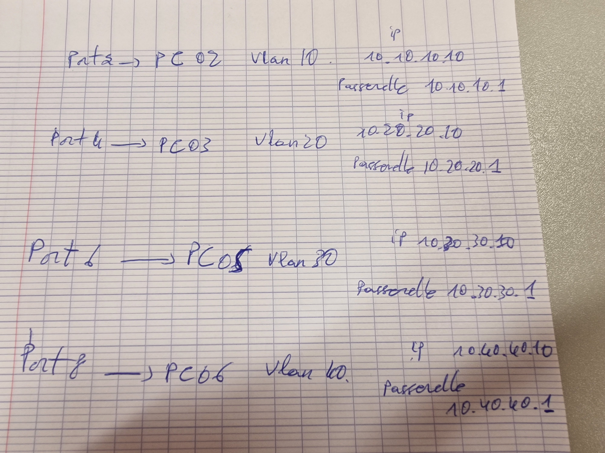
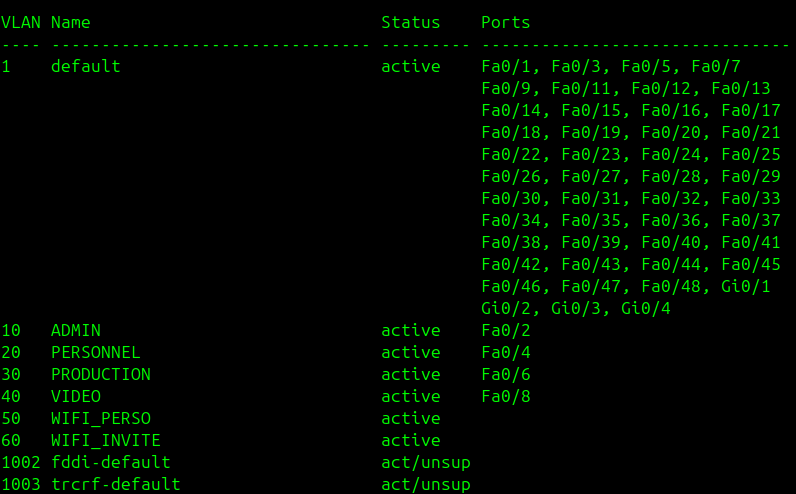
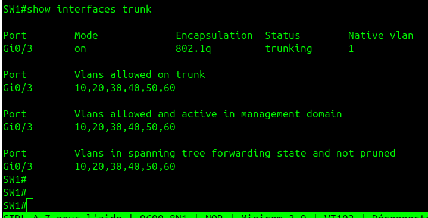
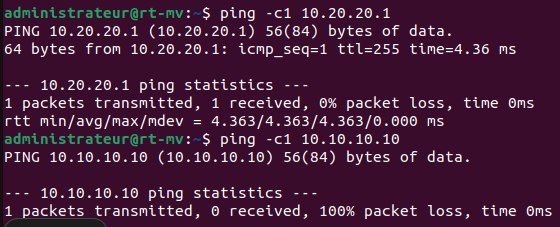
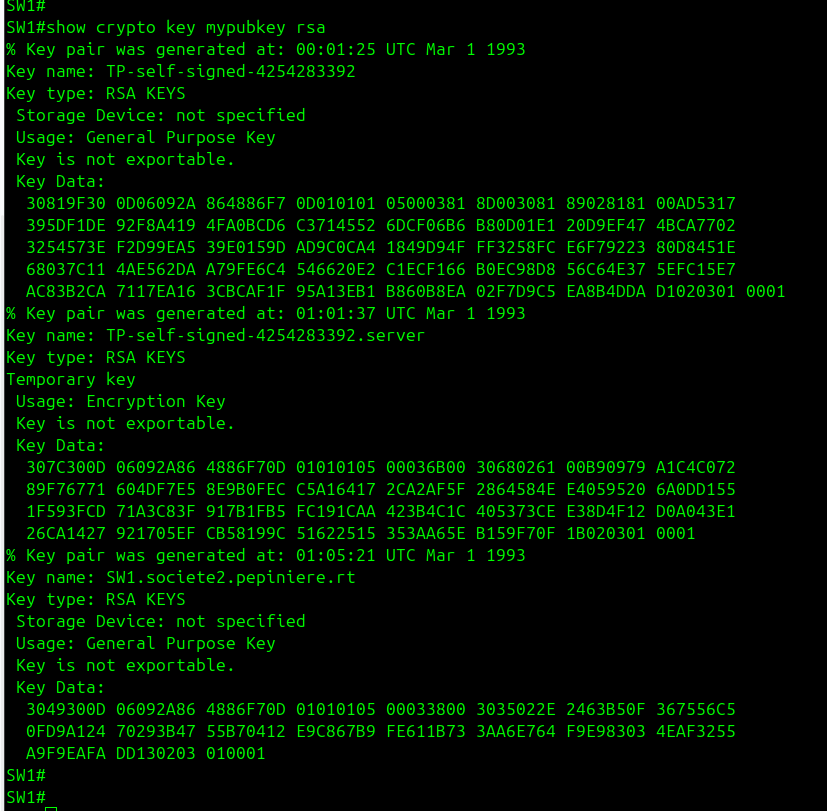
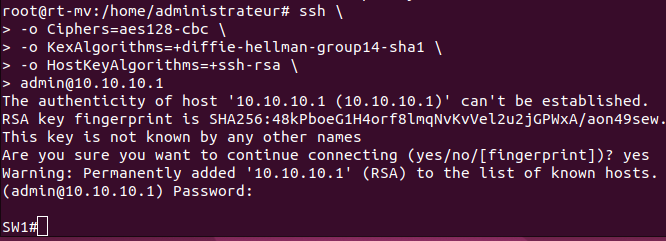
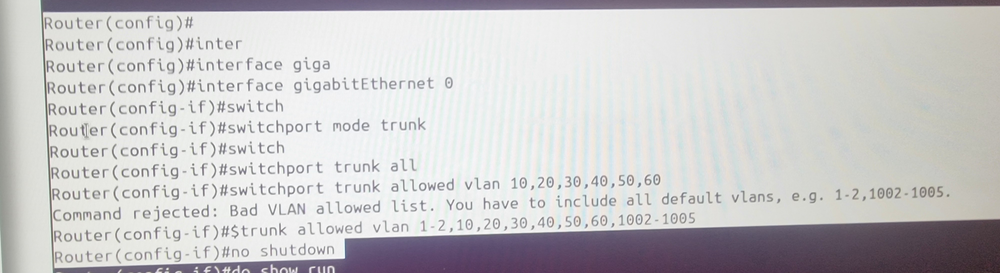
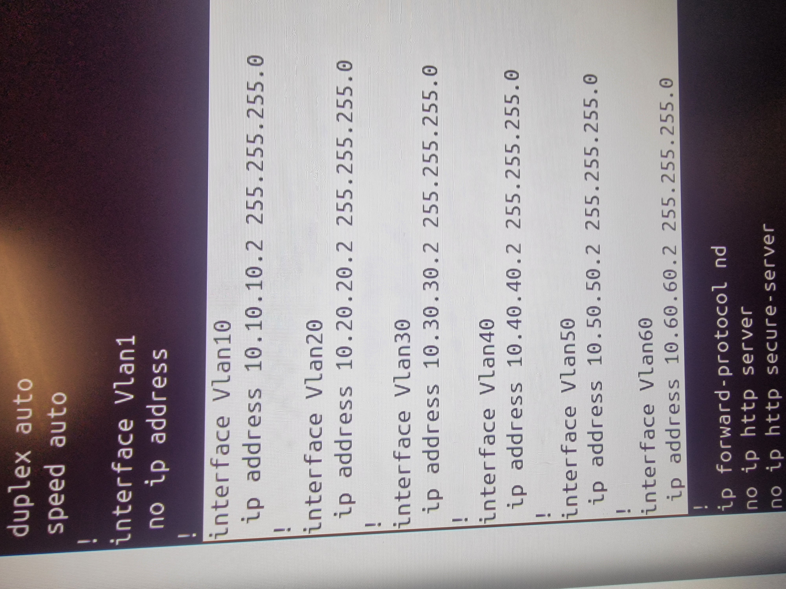
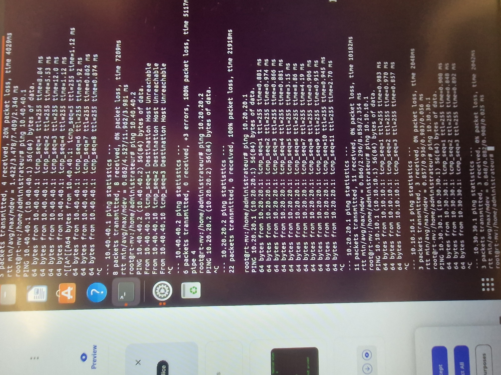
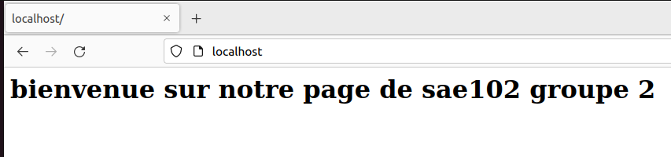

# Compte Rendu - TP Final

**Date :** 28 Janvier 2026 

---

**Équipe :**
- Alex Jovéniaux
- Briac Le Meillat
- Yanni Dellatre Balcer
- Thierno Barry
- Florian Sauvage

---

## 1. Mise en place et préparation

Nous étions installés en salle J0 04. Avant de commencer la configuration, nous avons rencontré quelques difficultés : le port console du switch était difficile d'accès car situé à l'arrière. De plus, tous les ports muraux étaient déjà occupés, nous avons donc dû débrancher les câbles RJ45 situés à l'arrière du mur pour relier directement les cartes réseaux à notre switch.

Nous avons ensuite réparti sur une feuille l'attribution des ports, des VLANs et des adresses IP statiques temporaires (en attendant la mise en place du DHCP).

La répartition était la suivante :

| Port | Machine | VLAN | Adresse IP | Passerelle |
|------|---------|------|------------|------------|
| Port 2 | PC02 | VLAN 10 | 10.10.10.10 | 10.10.10.1 |
| Port 4 | PC03 | VLAN 20 | 10.20.20.10 | 10.20.20.1 |
| Port 6 | PC05 | VLAN 30 | 10.30.30.10 | 10.30.30.1 |
| Port 8 | PC06 | VLAN 40 | 10.40.40.10 | 10.40.40.1 |

---

## 2. Configuration des VLANs

Nous avons connecté le PC6 au port console du switch et configuré celui-ci via minicom. Les VLANs suivants ont été créés et nommés :

| VLAN ID | Nom | Port attribué |
|---------|-----|---------------|
| 10 | ADMIN | Fa0/2 |
| 20 | PERSONNEL | Fa0/4 |
| 30 | PRODUCTION | Fa0/6 |
| 40 | VIDEO | Fa0/8 |
| 50 | WIFI_PERSO | - |
| 60 | WIFI_INVITE | - |

Chaque VLAN a été assigné à son port respectif puis activé.

---

## 3. Configuration du Trunk

Le port Gi0/3 a été configuré en mode trunk pour permettre le passage de tous les VLANs vers le routeur. L'encapsulation utilisée est 802.1Q.

Les VLANs 10, 20, 30, 40, 50 et 60 sont bien autorisés sur le trunk et actifs dans le domaine de management.

---

## 4. Tests de connectivité

Nous avons effectué des tests de ping depuis le routeur (rt-mv) pour vérifier la configuration :

**Résultats :**
- Ping vers 10.20.20.1 (passerelle VLAN 20) : succès, 0% de perte
- Ping vers 10.10.10.10 (machine VLAN 10) : échec, 100% de perte

Ce comportement est normal : les machines dans des VLANs différents ne peuvent pas communiquer directement entre elles sans routage inter-VLAN. On peut bien atteindre notre passerelle mais pas les machines des autres VLANs.

---

## 5. Configuration SSH

Pour permettre l'administration à distance sécurisée du switch, nous avons généré une paire de clés RSA via minicom.

Trois paires de clés ont été générées :
- TP-self-signed-4254283392 (clé générale)
- TP-self-signed-4254283392.server (clé serveur)
- SW1.societe2.pepiniere.rt (clé du switch)

Nous avons ensuite initié une connexion SSH depuis le routeur vers le switch (10.10.10.1) avec le compte admin :

La connexion SSH a été établie avec succès. L'empreinte RSA a été acceptée et ajoutée à la liste des hôtes connus.

---

## 6. Problèmes et routage INTER-VLAN

on a rencontrer des énormes problèmes sur le routeur, la configuration du routeur a était sauvegarder par quelqu’un d’autre et peu importe nos efforts ils ne se reintialise pas…
Nous sommes coincé sur une demande pour un mot de passe dans minicom, peu importe lequel on a essayer (Cisco, Progtr00, progtr00...) rien ne se passe, impossible de progresser à cause du matériel différent aux autres salles...

Ont a finalement pu forcer la reintialisation, à 11h40.

* **Création du trunk routeur:**

* **après avoir fait le trunk routeur on a fait les interfaces:**

* **Ensuite une fois que tout est configurer sur le switch & routeur, on test les pings:**

Tout est fonctionnel.

---

## 7. Serveur web VLAN 800

Le serveur web apache à bien était mis en place sur la machine, cependant l'accès au serveur depuis les autres VLAN n'est pas fonctionnel, nous souhaitions faire une capture wireshark pour répondre à la question a propos de l'accès internet, cependant wireshark n'est pas intaller sur la machine virtuelle ubuntu desktop, et il est impossible de l'installer sans accès internet.

