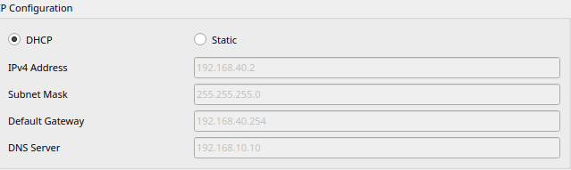
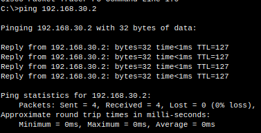
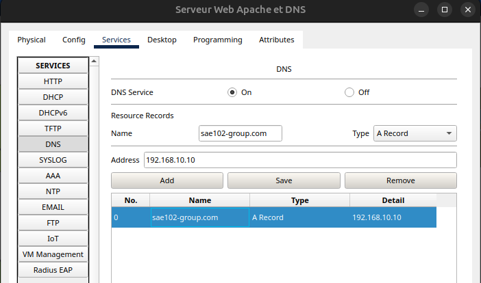
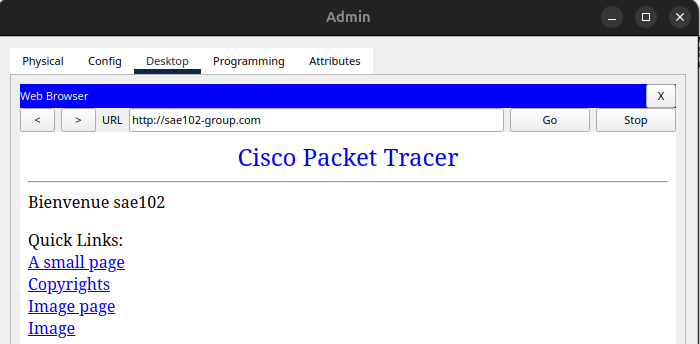
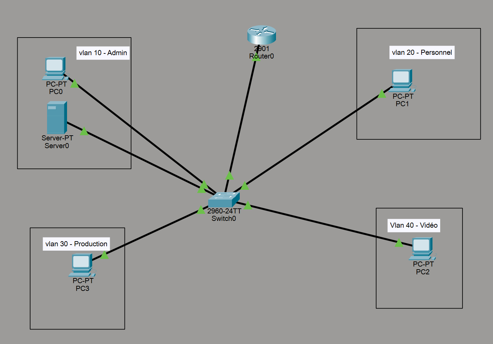

# Documentation Technique - SAE 1.02
## TP3 PARTIE 1 (complétion du TP2)

Briac Le Meillat

## 1. Architecture globale

### 1.1 Objectif

Déploiement d'une infrastructure réseau segmentée en VLANs avec routage inter-VLAN, DHCP et DNS.

### 1.2 Découpage en VLANs

L'infrastructure comprend 5 VLANs distincts :

- **VLAN 10 (ADMIN)** : 192.168.10.0/24 → Gateway 192.168.10.254
  - Rôle : Administration et services réseau

- **VLAN 20 (PERSONNEL)** : 192.168.20.0/24 → Gateway 192.168.20.254
  - Rôle : Postes de travail utilisateurs

- **VLAN 30 (PRODUCTION)** : 192.168.30.0/24 → Gateway 192.168.30.254
  - Rôle : Équipements de production

- **VLAN 40 (VIDEO)** : 192.168.40.0/24 → Gateway 192.168.40.254
  - Rôle : Système de vidéosurveillance

- **VLAN 800 (INTERNET)** : 192.168.100.0/24 → Gateway 192.168.100.254
  - Rôle : Connexion vers l'extérieur

## 2. Configuration Switch Cisco 2960

### 2.1 Déclaration des VLANs

Accès mode privilégié :

```
enable
configure terminal
```

Création :

```
vlan 10
name ADMIN
vlan 20
name PERSONNEL
vlan 30
name PRODUCTION
vlan 40
name VIDEO
exit
```

### 2.2 Assignation des ports

Port Fa0/1 → VLAN 10 :

```
interface fastEthernet 0/1
switchport mode access
switchport access vlan 10
exit
```

Port Fa0/2 → VLAN 20 :

```
interface fastEthernet 0/2
switchport mode access
switchport access vlan 20
exit
```

Port Fa0/3 → VLAN 30 :

```
interface fastEthernet 0/3
switchport mode access
switchport access vlan 30
exit
```

### 2.3 Port Trunk (vers routeur)

```
interface gigabitEthernet 0/1
switchport mode trunk
switchport trunk native vlan 1
exit
end
write
```

---

## 3. Configuration Routeur Cisco 1941/2901

### 3.1 Interface principale

```
enable
configure terminal
interface gigabitEthernet 0/0
no shutdown
exit
```

### 3.2 Sous-interfaces (Router-on-a-Stick)

VLAN 10 :

```
interface gigabitEthernet 0/0.10
encapsulation dot1Q 10
ip address 192.168.10.254 255.255.255.0
exit
```

VLAN 20 :

```
interface gigabitEthernet 0/0.20
encapsulation dot1Q 20
ip address 192.168.20.254 255.255.255.0
exit
```

VLAN 30 :

```
interface gigabitEthernet 0/0.30
encapsulation dot1Q 30
ip address 192.168.30.254 255.255.255.0
exit
```

VLAN 40 :

```
interface gigabitEthernet 0/0.40
encapsulation dot1Q 40
ip address 192.168.40.254 255.255.255.0
exit
```

### 3.3 Serveur DHCP intégré

Adresses exclues :

```
ip dhcp excluded-address 192.168.10.254
ip dhcp excluded-address 192.168.10.10
ip dhcp excluded-address 192.168.20.254
ip dhcp excluded-address 192.168.30.254
ip dhcp excluded-address 192.168.40.254
```

Pool Personnel :

```
ip dhcp pool POOL_PERSONNEL
network 192.168.20.0 255.255.255.0
default-router 192.168.20.254
dns-server 192.168.10.10
exit
```

Pool Production :

```
ip dhcp pool POOL_PRODUCTION
network 192.168.30.0 255.255.255.0
default-router 192.168.30.254
dns-server 192.168.10.10
exit
```

Pool Vidéo :

```
ip dhcp pool POOL_VIDEO
network 192.168.40.0 255.255.255.0
default-router 192.168.40.254
dns-server 192.168.10.10
exit
end
write
```

## 4. Services réseau

### 4.1 Serveur (VLAN ADMIN)

Paramètres IP statiques :

```
Adresse IP : 192.168.10.10
Masque : 255.255.255.0
Passerelle : 192.168.10.254
```

### 4.2 Services configurés

- Service DHCP (configuré sur routeur)
- Service DNS (serveur 192.168.10.10)

## 5. Tests et résultats

### 5.1 Fonctionnement DHCP

Capture d'écran montrant l'attribution automatique d'adresses :



### 5.2 Routage inter-VLAN

Test de ping entre VLAN 20 et VLAN 30 :



Le routage entre VLANs fonctionne correctement.

### 5.3 Résolution DNS

Configuration DNS :



Accès depuis un PC client :



Le service DNS répond correctement aux requêtes.

## 6. Schéma de l'infrastructure


