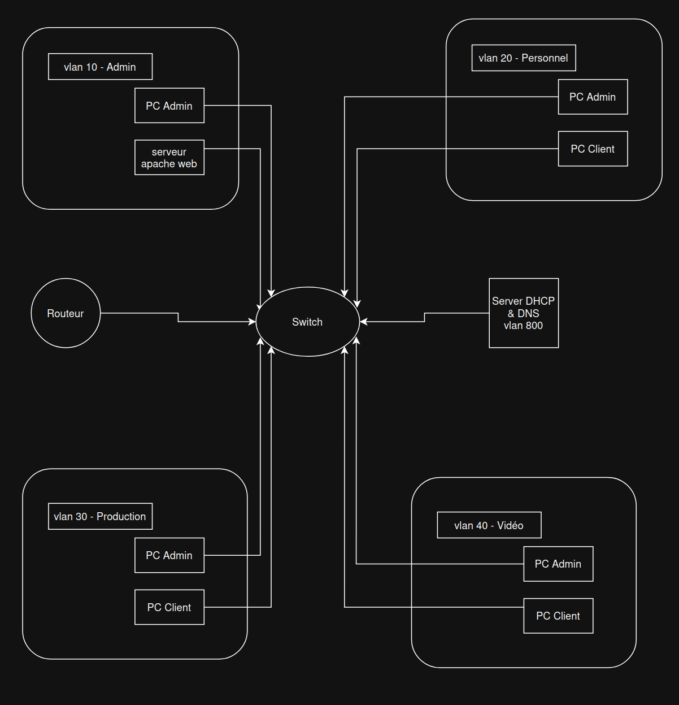
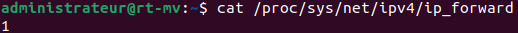
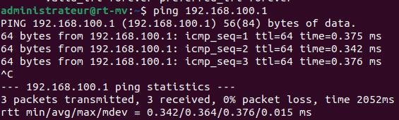
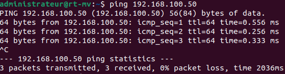

# SAE 1.02 - TP3 (Partie 2)
  
Réalisé par : Briac Le Meillat

## Topologie du réseau

Le réseau est découpé en plusieurs segments via des VLANs :

**VLAN 10 - ADMIN**  
Réseau : 192.168.10.0/24  
Passerelle : 192.168.10.254  
Utilisation : Administration et services réseau

**VLAN 20 - PERSONNEL**  
Réseau : 192.168.20.0/24  
Passerelle : 192.168.20.254  
Utilisation : Postes de travail du personnel

**VLAN 30 - PRODUCTION**  
Réseau : 192.168.30.0/24  
Passerelle : 192.168.30.254  
Utilisation : Machines de production

**VLAN 40 - VIDEO**  
Réseau : 192.168.40.0/24  
Passerelle : 192.168.40.254  
Utilisation : Système de vidéosurveillance

**VLAN 800 - INTERNET**  
Réseau : 192.168.100.0/24  
Passerelle : 192.168.100.254  
Utilisation : Connexion externe



## Partie 1 : VM Routeur

### Description

La machine virtuelle faisant office de routeur comporte :
- Une carte en mode NAT (enp0s3) : accès WAN
- Une carte en mode réseau interne (enp0s8) : accès LAN

### Configuration IP fixe

Édition du fichier `/etc/network/interfaces` :

```
auto enp0s8
iface enp0s8 inet static
    address 192.168.10.254
    netmask 255.255.255.0
```

Application des changements :

```bash
sudo ifdown enp0s8
sudo ifup enp0s8
```

Contrôle :

```bash
ip a show enp0s8
```

### Activation du routage

Pour permettre le transit des paquets entre les réseaux :

```bash
sudo sysctl -w net.ipv4.ip_forward=1
```

Persistance via `/etc/sysctl.conf` :

```
net.ipv4.ip_forward=1
```

Validation :

```bash
sudo sysctl -p
cat /proc/sys/net/ipv4/ip_forward
```



## Partie 2 : Service DHCP

### Déploiement

```bash
sudo apt update
sudo apt install isc-dhcp-server -y
```

### Définition des plages

Contenu de `/etc/dhcp/dhcpd.conf` :

```
default-lease-time 3600;
max-lease-time 7200;
authoritative;

subnet 192.168.10.0 netmask 255.255.255.0 {
    range 192.168.10.50 192.168.10.150;
    option routers 192.168.10.254;
    option domain-name-servers 192.168.10.254, 1.1.1.1;
    option domain-name "vlan-admin.net";
}

subnet 192.168.20.0 netmask 255.255.255.0 {
    range 192.168.20.50 192.168.20.150;
    option routers 192.168.20.254;
    option domain-name-servers 192.168.10.254, 1.1.1.1;
    option domain-name "vlan-personnel.net";
}

subnet 192.168.30.0 netmask 255.255.255.0 {
    range 192.168.30.50 192.168.30.150;
    option routers 192.168.30.254;
    option domain-name-servers 192.168.10.254, 1.1.1.1;
    option domain-name "vlan-prod.net";
}

subnet 192.168.40.0 netmask 255.255.255.0 {
    range 192.168.40.50 192.168.40.150;
    option routers 192.168.40.254;
    option domain-name-servers 192.168.10.254, 1.1.1.1;
    option domain-name "vlan-video.net";
}
```

Spécification de l'interface dans `/etc/default/isc-dhcp-server` :

```
INTERFACESv4="enp0s8"
```

Mise en service :

```bash
sudo systemctl restart isc-dhcp-server
sudo systemctl enable isc-dhcp-server
sudo systemctl status isc-dhcp-server
```

## Partie 3 : Résolution DNS

### Installation de dnsmasq

```bash
sudo apt install dnsmasq -y
```

### Configuration

Édition de `/etc/dnsmasq.conf` :

```
interface=enp0s8
listen-address=192.168.10.254

domain=reseau.local
local=/reseau.local/

address=/routeur.reseau.local/192.168.10.254
address=/serveur.reseau.local/192.168.10.10
address=/web.reseau.local/192.168.10.10

server=1.1.1.1
server=9.9.9.9

cache-size=1000
```

Démarrage :

```bash
sudo systemctl restart dnsmasq
sudo systemctl enable dnsmasq
```

## Partie 4 : Hébergement Web

### Installation d'Apache

```bash
sudo apt install apache2 -y
```

### Page d'accueil

Fichier `/var/www/html/index.html` :

```html
<!DOCTYPE html>
<html>
<head>
    <title>TP3 - Serveur Web</title>
</head>
<body>
    <h1>Serveur Web du réseau</h1>
    <p>Page de test - SAE 1.02</p>
</body>
</html>
```

Démarrage du service :

```bash
sudo systemctl restart apache2
sudo systemctl enable apache2
```

## Partie 5 : Tests

### Vérification DHCP

Depuis une VM cliente :

```bash
sudo dhclient -v
ip a
```


Adresse obtenue correctement dans la plage définie.

### Test de connectivité

Ping vers le routeur :

```bash
ping 192.168.10.254
```



### Communication entre VMs

Test depuis une VM vers une autre :

```bash
ping 192.168.10.50
```



Les machines communiquent sans problème sur le réseau interne.

## Bilan

L'ensemble de l'infrastructure est opérationnelle :
- Le routeur assure le transit entre les VLANs
- Le DHCP distribue les adresses 
- Apache sert les pages web sur le réseau interne