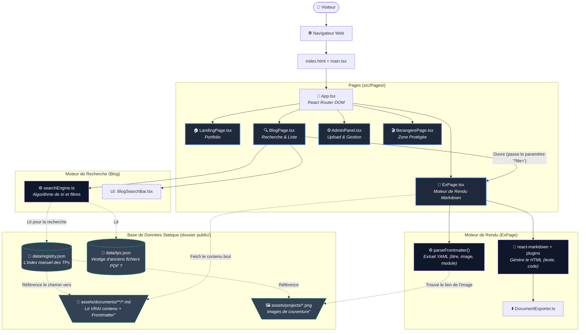

# Analyse Architecturale du Projet "Briac Le Meillat"
**Date :** 02/06/2026

Ce document a pour but de "débroussailler" la structure du projet, de comprendre précisément comment les données transitent (notamment les TPs, les images et les recherches), et de proposer un plan d'action pour rendre l'ensemble propre, maintenable et automatisé.

---

## 1. Cartographie Détaillée du Système (Le Grand Schéma)

Voici comment tous les éléments de votre site s'articulent actuellement. Suivez les flèches pour comprendre le cycle de vie d'une page ou d'une donnée.

---

## 2. Analyse Profonde du Flux (Comment ça marche actuellement ?)

1. **La Recherche (`BlogPage.tsx`) :**
   Quand un utilisateur arrive sur le blog, le composant `BlogPage` fait une requête (`fetch`) pour télécharger `registry.json` et `tps.json`.
   Le fichier `registry.json` agit comme un immense "annuaire téléphonique". Il contient une liste JSON tapée à la main de vos TPs avec leur titre, leur image, leur module (R201, etc.) et surtout, leur chemin (`path`).

2. **La Sélection :**
   Quand on clique sur un résultat de recherche, on est redirigé vers `/ex?file=assets/documents/.../tpX.md`.

3. **Le Rendu (`ExPage.tsx`) :**
   Le composant `ExPage` récupère le paramètre `file` dans l'URL. Il fait ensuite un `fetch()` pour télécharger ce fichier `.md`.
   Il lit l'en-tête (le *frontmatter* entre les `---`) pour trouver l'image de couverture, le titre, et les technologies, puis il demande à `react-markdown` d'afficher le reste du texte.

---

## 3. Le Problème Actuel (L'origine du "Bordel")

Votre architecture souffre d'un défaut majeur d'organisation des données qu'on appelle la **"Double Source de Vérité"** (Dual Source of Truth).

Actuellement, les métadonnées d'un document (son titre, son image, son module R201) existent à **deux endroits différents** :
1. Dans le fichier `registry.json` (qui sert à la recherche).
2. Dans le *Frontmatter* du fichier `.md` (qui sert à l'affichage final).

**Conséquences :**
- **Oublis fréquents :** Comme on l'a vu pour les TP10 et TP11, on écrit un beau fichier `.md`, on le met dans le dossier, mais il n'apparaît pas sur le site parce qu'on a oublié d'aller l'inscrire manuellement dans `registry.json`.
- **Désynchronisation :** On corrige une faute de frappe dans le titre du `.md`, mais elle reste dans le `registry.json`. Le moteur de recherche affiche l'ancienne version.
- **Dossiers fourre-tout :** Toutes les images sont balancées dans `assets/projects/` et tous les fichiers textes dans `documents/.../`. Il est difficile de savoir quelle image correspond à quel TP.

---

## 4. Propositions d'Optimisation et de Rangement

Voici comment transformer ce projet en une architecture propre, automatisée et parfaitement "rangée".

### 💡 Optimisation 1 : La suppression totale de la saisie manuelle dans `registry.json` (URGENT)
Comme vous l'avez très bien remarqué, garder `registry.json` n'a pas de sens si tout est déjà dans les fichiers Markdown.
**La solution : Générer l'index automatiquement lors du "build".**
- **Comment :** Vous avez un fichier `generate-index.js` à la racine de votre projet. Il faut le modifier pour qu'il parcoure automatiquement tous les sous-dossiers de `public/assets/documents/`, qu'il ouvre chaque fichier `.md`, lise le *Frontmatter*, et génère automatiquement le `registry.json`. 
- **Bénéfice :** Vous n'ouvrirez plus jamais `registry.json`. Pour ajouter un TP, il suffira de glisser le fichier `.md` dans le dossier, et pouf, il apparaîtra partout (recherche, accueil, etc.).

### 💡 Optimisation 2 : L'organisation "Par Composant" (Co-location)
Arrêtez de séparer le texte de ses images. Adoptez une structure en "dossier par article".
**Actuellement :**
- `public/assets/documents/apprentissage/tech-internet/tp2.md`
- `public/assets/projects/tp2-passerelle-linux-visu.png`

**Nouvelle structure idéale :**
- `public/content/tech-internet/tp2-passerelle/`
  - `index.md` (Le texte)
  - `cover.png` (L'image de couverture)
  - `schema.png` (Une image utilisée dans le texte)
- **Bénéfice :** Si vous voulez supprimer ou modifier un TP, tout est au même endroit. Votre dossier `assets/projects/` ne sera plus un capharnaüm.

### 💡 Optimisation 3 : Nettoyage du Moteur de Recherche (`searchEngine.ts`)
Le moteur de recherche possède beaucoup de règles "en dur" (if "flask", if "cisco"). 
- **La solution :** Exploiter la puissance du *Frontmatter*. Si chaque fichier `.md` contient une propriété `tags: [linux, cisco, reseau]`, le moteur de recherche n'a plus besoin d'un dictionnaire codé en dur. Il lui suffit de vérifier si le mot tapé par l'utilisateur correspond à un des "tags" du document.

### 💡 Optimisation 4 : Nettoyage du fichier `tps.json`
Il semble y avoir un fichier `tps.json` qui fait doublon avec `registry.json` dans la page `BlogPage.tsx` (Ligne 70 : `fetch(...tps.json)`). Il faut vérifier si ce fichier est encore utile. S'il contient d'anciens PDFs, il vaudrait mieux les intégrer dans l'architecture principale ou le fusionner dans le script de génération automatique, afin de n'avoir qu'une seule et unique source pour la barre de recherche.

---

### Conclusion
Votre architecture React (Frontend) est excellente, moderne et très performante (Glassmorphism, animations, séparation des composants). Le seul "bordel" réside dans le CMS improvisé via les fichiers statiques (la gestion de la donnée). En automatisant la lecture du Frontmatter via un script Node.js avant chaque compilation, vous supprimerez 99% des erreurs d'oubli et des redondances.
