# 🏗️ Architecture Globale du Projet — `briac-le-meillat`

> Ce document cartographie **l'intégralité** du projet, du niveau macro jusqu'aux détails de chaque fichier.
> Tous les diagrammes sont en **Mermaid** et peuvent être zoomés dans un rendu compatible (GitHub, VS Code, Obsidian…).

---

## 1. 🌍 Vue Satellite — Les Grandes Zones du Monorepo

Le dépôt racine n'est **pas** uniquement l'application web. C'est un **monorepo** qui regroupe l'app, la documentation académique, des scripts utilitaires, des outils d'analyse, un template Vite de référence, et du contenu privé.

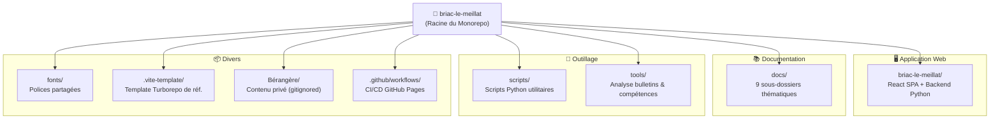

**Fichiers notables à la racine :**

| Fichier | Rôle |
|---------|------|
| `README.md` | Doc d'entrée du projet |
| `requirements.txt` | Dépendances Python (backend + scripts) |
| `me.md` | Profil personnel, compétences, projets (gitignored) |
| `projets_cv.md` | Liste projets pour le CV (gitignored) |
| `BERANGERE_GUIDE.md` | Guide contenu privé (gitignored) |
| `convert_psd.py` | Script conversion PSD (gitignored) |
| `pdf_dump.txt` / `pdf_text.txt` | Extractions de PDF académiques |

---

## 2. 🖥️ L'Application Web — Vue d'Ensemble Technique

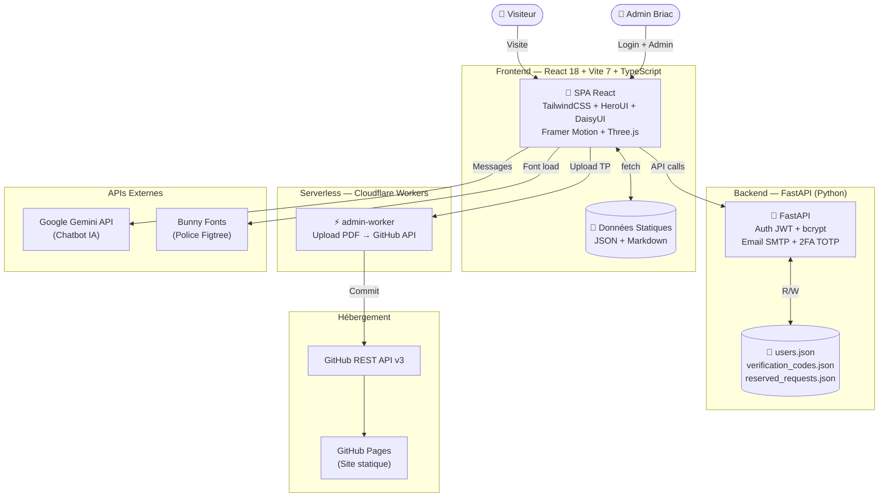

---

## 3. 📂 Arborescence de `briac-le-meillat/` (l'app)

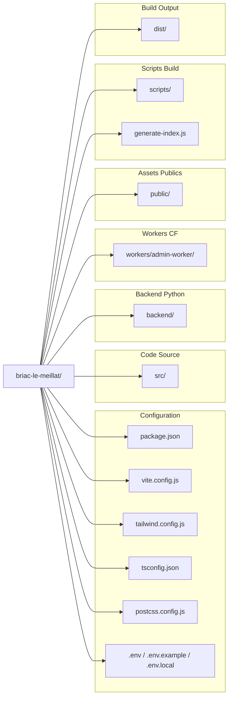

---

## 4. 🧩 Architecture Frontend — React en Détail

### 4.1 Point d'entrée et Providers

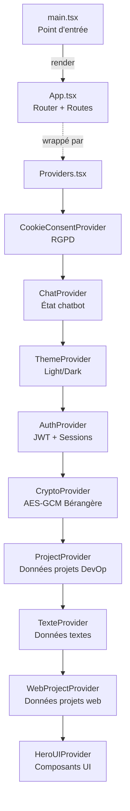

### 4.2 Routing — Toutes les Routes

```mermaid
flowchart TD
    ROUTER["App.tsx — BrowserRouter"]

    subgraph SG_17 ["🏠 Pages Publiques"]
        R1["/ → LandingPage"]
        R2["/original → LandingPageOriginal"]
        R3["/oldold → LandingPageOldOld"]
        R4["/cv → CVPage"]
        R5["/contact → Contact"]
        R6["/blog → BlogPage"]
        R7["/recherches → Research"]
        R8["/recherches/optimisation-neurones → OptimisationNeurones"]
        R9["/keynote-but1 → KeynoteBut1Page"]
        R10["/projects-visualisation → ProjectsVisualisation"]
    end

    subgraph SG_18 ["🔐 Auth & Abonnement"]
        R11["/login → SignInSide"]
        R12["/subscribe → Subscribe"]
        R13["/dashboard → Dashboard"]
    end

    subgraph SG_19 ["⚙️ Admin"]
        R14["/admin → AdminPanel"]
        R15["/briac-admin → AdminDashboard"]
        R16["/ex → ExPage"]
    end

    subgraph SG_20 ["🎬 Bérangère (Lazy + Chiffré)"]
        R17["/berangere → BerangerePage"]
        R18["/berangere-edition → BerangerEditionPage"]
        R19["/berangere/serie/:id → EpisodePage"]
    end

    subgraph SG_21 ["📋 Référentiel"]
        R20["/ref/caisse-landing → CaisseLandingPage"]
        R21["/ref/caisse-nexus-prop → CaisseNexusPropPage"]
    end

    subgraph SG_22 ["🛠️ DEV Only"]
        R22["/realisations/:id → ProjectDetails"]
        R23["/admin/realisations → RealisationsAdmin"]
        R24["/admin/textes → TextesAdmin"]
    end

    ROUTER --> R1 & R2 & R3 & R4 & R5 & R6 & R7 & R8 & R9 & R10
    ROUTER --> R11 & R12 & R13
    ROUTER --> R14 & R15 & R16
    ROUTER --> R17 & R18 & R19
    ROUTER --> R20 & R21
    ROUTER --> R22 & R23 & R24


```

**Composants globaux** (rendus sur toutes les routes) :
- `CryptoModal` — modale de déchiffrement Bérangère
- `ChatWidget` — assistant IA flottant (Gemini)

### 4.3 Les 57 Composants (`src/Components/`)

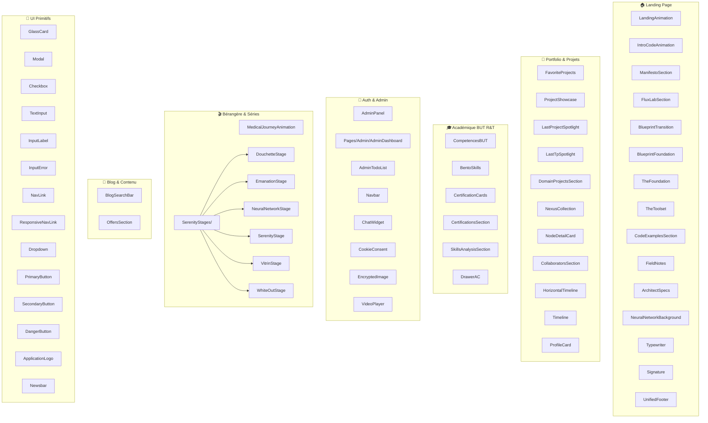

### 4.4 Les Contexts React (État Global)

| Context | Fichier | Rôle |
|---------|---------|------|
| **AuthContext** | `AuthContext.tsx` | Auth JWT, login/signup, 2FA, gestion abonnements free/reserved |
| **CryptoContext** | `CryptoContext.tsx` | Déchiffrement AES-GCM des contenus Bérangère, clé en sessionStorage |
| **ProjectContext** | `ProjectContext.tsx` | Données projets DevOp |
| **TexteContext** | `TexteContext.tsx` | Données textes/articles |
| **WebProjectContext** | `WebProjectContext.tsx` | Données projets web (projects.json) |
| **ThemeProvider** | `ThemeProvider.tsx` | Thème light/dark, localStorage |
| **CookieConsentContext** | `CookieConsentContext.tsx` | Consentement RGPD, localStorage |
| **ChatContext** | `ChatContext.tsx` | État du chatbot IA |

### 4.5 Données Frontend (`src/data/`)

| Fichier | Contenu |
|---------|---------|
| `projects.json` | Projets web (14 Ko) |
| `journey.ts` | Parcours chronologique (17 Ko) |
| `articles.json` | Liste articles blog |
| `skills_analysis.json` | Analyse compétences |
| `articles/article-1.md`, `article-2.md` | Contenu articles en Markdown |

### 4.6 Utilitaires & Types

| Fichier | Rôle |
|---------|------|
| `Utils/searchEngine.ts` | Moteur de recherche interne |
| `Utils/DocumentExporter.ts` | Export de documents |
| `constants/serenity.ts` | Constantes animation Serenity |
| `types/index.d.ts` | Types TypeScript globaux |
| `types/global.d.ts` | Déclarations globales |
| `types/vite-env.d.ts` | Types env Vite |

---

## 5. 🐍 Backend FastAPI

```mermaid
flowchart TD
    FASTAPI["main.py — FastAPI<br>Port 8001"]

    subgraph SG_30 ["🔐 Auth Endpoints"]
        LOGIN["POST /api/auth/login<br>JWT + bcrypt"]
        SIGNUP["POST /api/auth/signup<br>Hash + code vérif"]
        ME["GET /api/auth/me<br>Session restore"]
        VERIFY["POST /api/auth/verify-email"]
        SETUP2FA["POST /api/auth/setup-2fa<br>QR TOTP"]
        VERIFY2FA["POST /api/auth/verify-2fa"]
    end

    subgraph SG_31 ["📬 Contact & Abo"]
        CONTACT["POST /api/contact<br>Email SMTP"]
        SUB["POST /api/subscribe"]
        CONFIG["GET /api/config"]
    end

    subgraph SG_32 ["🔒 Accès Reserved"]
        REQ["POST /api/reserved/request"]
        GET_REQ["GET /api/admin/requests"]
        APPROVE["POST /api/admin/requests/:email/approve"]
        REJECT["POST /api/admin/requests/:email/reject"]
    end

    subgraph SG_33 ["💾 Stockage Fichiers"]
        USERS[("users.json")]
        CODES[("verification_codes.json")]
        REQUESTS[("reserved_requests.json")]
    end

    FASTAPI --> LOGIN & SIGNUP & ME & VERIFY & SETUP2FA & VERIFY2FA
    FASTAPI --> CONTACT & SUB & CONFIG
    FASTAPI --> REQ & GET_REQ & APPROVE & REJECT

    LOGIN & SIGNUP & ME --> USERS
    VERIFY --> CODES
    REQ & APPROVE & REJECT --> REQUESTS


```

**Dépendances backend** : FastAPI, uvicorn, bcrypt, python-jose (JWT), pyotp, qrcode, smtplib

---

## 6. ⚡ Cloudflare Worker (`workers/admin-worker/`)

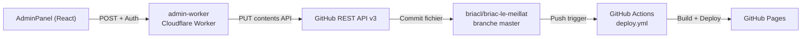

Rôle : permet à l'admin d'uploader des PDF de TP directement depuis l'interface, qui sont committés sur GitHub puis déployés automatiquement.

---

## 7. 📂 Assets Publics (`public/`)

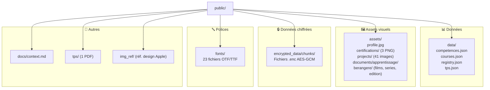

---

## 8. 🔐 Système de Chiffrement Bérangère

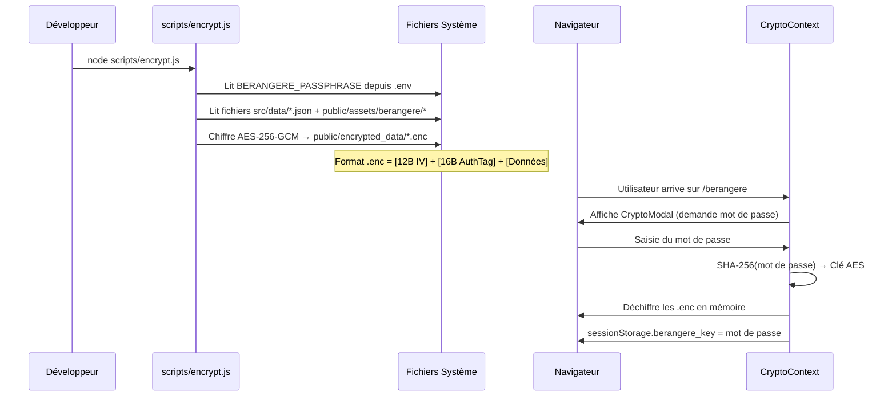

---

## 9. 📚 Documentation (`docs/`)

```mermaid
flowchart TB
    DOCS_ROOT["docs/"]

    subgraph SG_39 ["🎓 apprentissage/ — Cours & TPs BUT R&T"]
        NET["reseau/<br>54 fichiers (PDF, MD, PNG)<br>IPv4, OSPF, RIP, VLAN, ARP..."]
        BSR["bases-services-reseaux/<br>Apache, Nginx, Samba"]
        TECH["tech-internet/<br>TPs HTTP/HTML"]
        TEL["telephonie/<br>TPs téléphonie"]
        VIRT["virtualisation/<br>Docker, VirtualBox, VMware"]
        SAE["sae102/<br>Livrables SAE102"]
        WIN["admin system windows/<br>Administration Windows"]
    end

    subgraph SG_40 ["📝 content/ — Contenu éditorial"]
        STORY["story.md, story2.md<br>Narratif personnel"]
        SKILLS["skills.md, competences.md"]
        LANDING_NOTES["LANDINGPAGE_V2_NOTES.md"]
        CONV["conv-gemini.md, conv-gemini-claude.md"]
    end

    subgraph SG_41 ["🎨 identity-design/ — Identité visuelle"]
        DESIGN["archi_narrative_design.md<br>architecture-landing-page-reflexion.md<br>manifeste-storytelling.md<br>prompt.md, strat-marque.md..."]
    end

    subgraph SG_42 ["📋 portfolio/ — Bilan & Soutenance"]
        BILAN["bilan-portfolio.md (41 Ko)<br>PLAN.md, specs-list.md<br>texte-soutenance.md"]
    end

    subgraph SG_43 ["🔬 research_archi/ — Réflexions techniques"]
        RESEARCH["ANALYSE_SITE.md<br>LANDING_STRUCTURE.md<br>NNB_CONFIG.md<br>PLAN_AJUSTEMENTS.md<br>PLAN_ASSOCIATION_OBSIDIAN.md"]
    end

    subgraph SG_44 ["⚙️ technical/ — Guides techniques"]
        TECH_DOCS["auth_system_documentation.md<br>contact_form_documentation.md<br>EMAIL_SYSTEM_GUIDE.md<br>SERENITY_IMPLEMENTATION_GUIDE.md<br>SERVERLESS_EMAIL_GUIDE.md"]
    end

    subgraph SG_45 ["📜 legal/"]
        LEGAL["credits.md<br>mentions-legales.md<br>politique-confidentialite.md"]
    end

    subgraph SG_46 ["🖼️ projects-visualisation/"]
        PROJVIZ["8 sous-dossiers logos<br>arcus, cortex, echo, folyo,<br>heryze, netguardian..."]
    end

    subgraph SG_47 ["📝 notes/"]
        NOTES["commandes.md, explications.md<br>fonctionnement.md, processing.md"]
    end

    DOCS_ROOT --> NET & BSR & TECH & TEL & VIRT & SAE & WIN
    DOCS_ROOT --> STORY & SKILLS & LANDING_NOTES & CONV
    DOCS_ROOT --> DESIGN & BILAN & RESEARCH & TECH_DOCS & LEGAL & PROJVIZ & NOTES


```

---

## 10. 🔧 Scripts & Outils (racine)

### `scripts/` — Utilitaires Python

| Script | Rôle |
|--------|------|
| `dump_pdf.py` | Extraction brute de texte depuis un PDF |
| `peek_pdf.py` / `peek_range.py` / `peek_toc.py` | Inspection de pages/TOC d'un PDF |
| `check_p74.py` | Vérification page 74 d'un PDF |
| `extract_courses.py` | Extraction structurée des cours depuis PDF |
| `find_resources.py` | Recherche de ressources dans les fichiers |
| `compress_video.sh` | Compression vidéo (bash) |
| `start_video_server.py` | Serveur local pour lecture vidéo |

### `tools/` — Analyse académique

| Fichier | Rôle |
|---------|------|
| `parse_bulletin.py` | Parse un bulletin PDF → `bulletin.json` |
| `analyze_skills.py` | Analyse des compétences depuis le bulletin |
| `data/bulletin.pdf` | Bulletin scolaire source |
| `data/bulletin.json` | Données structurées extraites |

---

## 11. 📦 `.vite-template/` — Template Turborepo

Un **template de référence** (monorepo Turborepo) avec :
- `apps/client/` — App Vite + React + HeroUI (template frontend)
- `apps/cloudflare-worker/` — Worker Cloudflare (template serverless)
- Config Turbo (`turbo.json`), Yarn, workspaces

Ce template n'est **pas** utilisé en production — c'est une référence architecturale.

---

## 12. 🚀 CI/CD — Pipeline de Déploiement

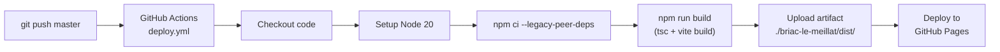

---

## 13. 🗺️ Carte Complète des Flux de Données

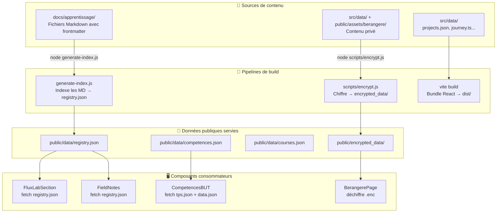

---

## 14. 🔑 Résumé des Accès & Sécurité

| Zone | Protection | Mécanisme |
|------|-----------|-----------|
| Pages publiques (`/`, `/cv`, `/blog`...) | Aucune | Accès libre |
| Login/Signup (`/login`, `/subscribe`) | Auth JWT | FastAPI + bcrypt + 2FA TOTP |
| Dashboard (`/dashboard`) | Auth requise | JWT Bearer token |
| Admin (`/admin`, `/briac-admin`) | Auth + rôle admin | Vérification côté client |
| Routes DEV (`/admin/realisations`...) | `import.meta.env.DEV` | N'existent qu'en dev |
| Bérangère (`/berangere/*`) | Chiffrement AES-GCM | Mot de passe → SHA-256 → clé AES |
| Worker CF | Secret `ADMIN_PASSWORD` | Wrangler secrets |

---

> **Ce document est une photo complète du projet au 11 juillet 2026.** Il couvre chaque dossier, fichier significatif, flux de données, et mécanisme de sécurité du monorepo `briac-le-meillat`.
