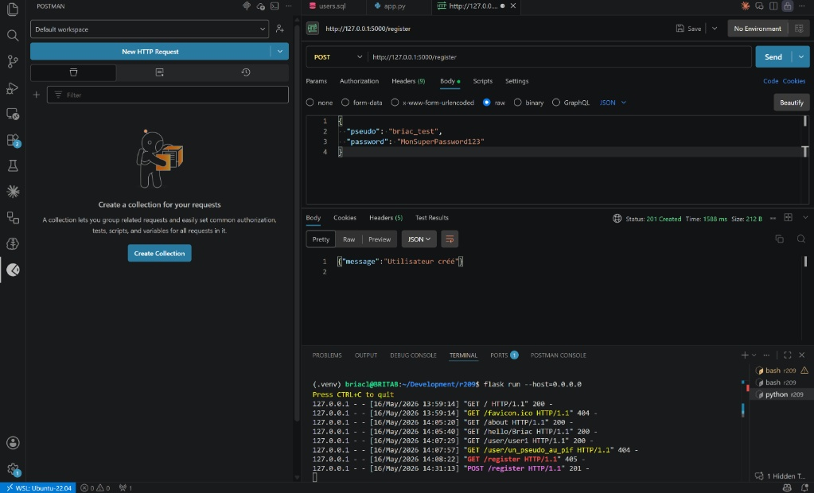
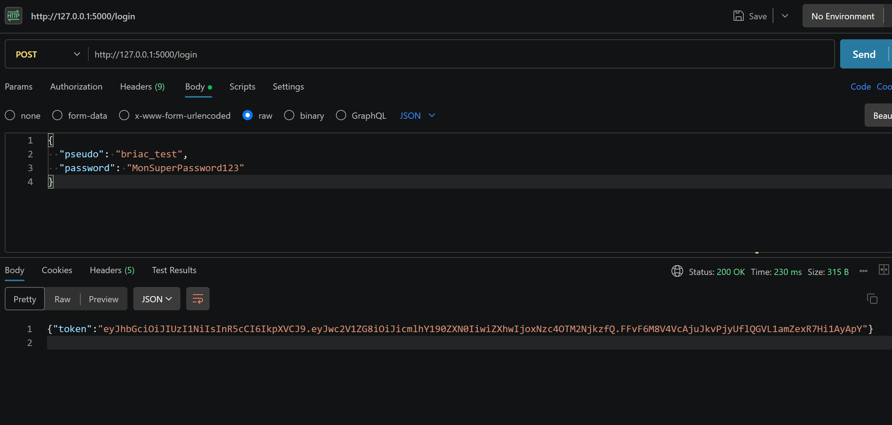
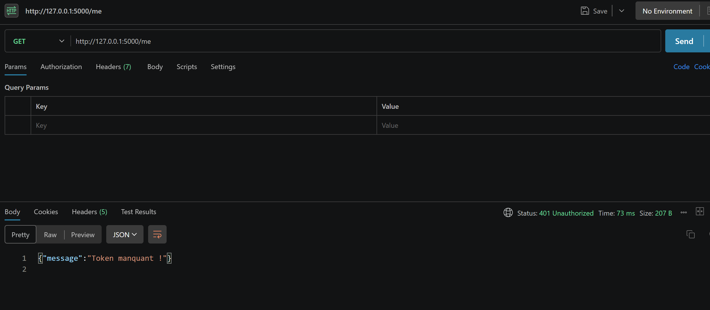
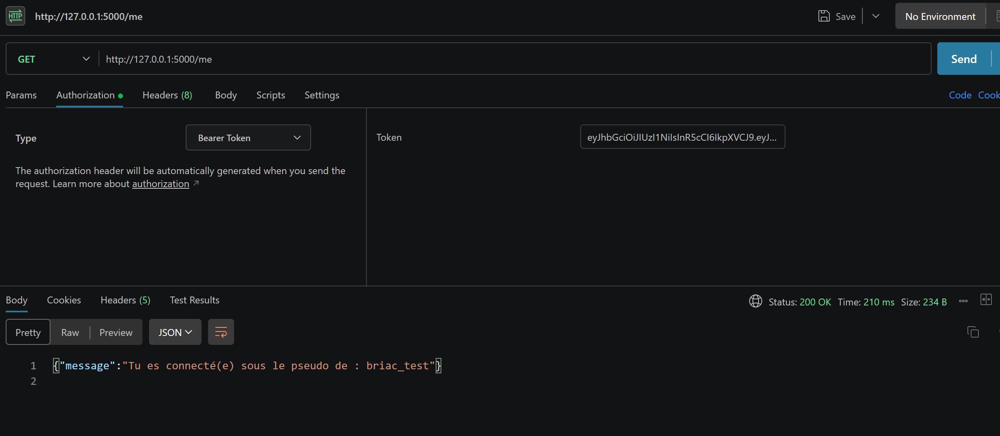
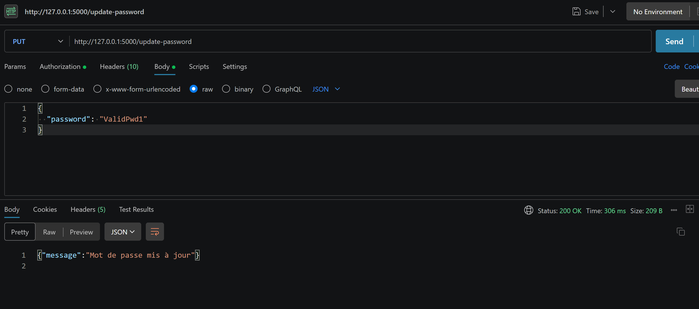
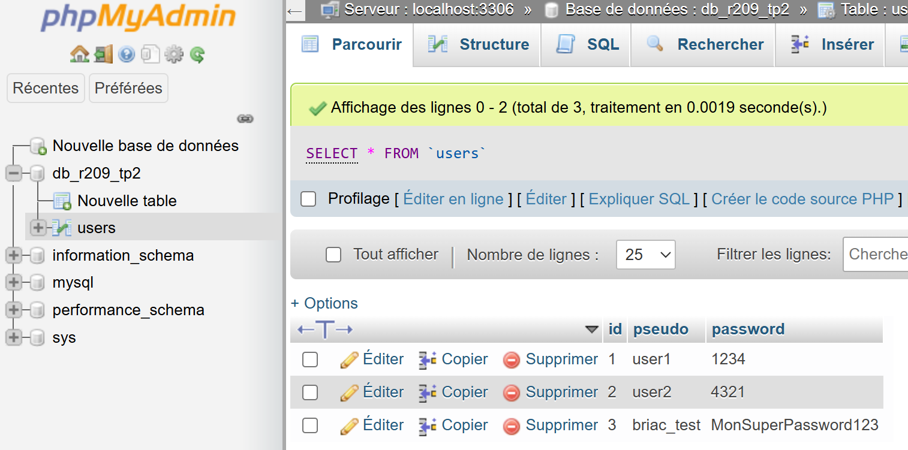
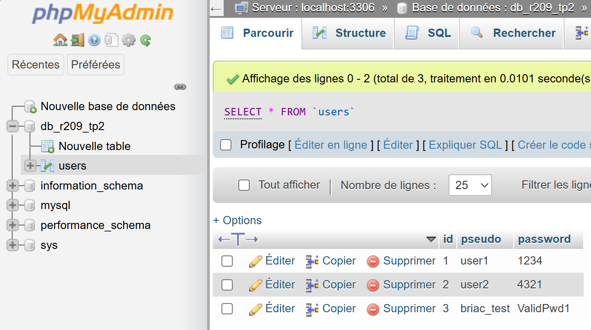

# 🚀 TP : Création d'une API REST avec Flask & MySQL
### Backend, Base de Données et Sécurité JWT | Briac Le Meillat

Ce TP vous fait manipuler les trois piliers fondamentaux de l'architecture d'un service web sans l'abstraction d'un gros framework. L'objectif est de comprendre **l'envers du décor**.

---

## 🎯 Pourquoi ce TP est crucial ?

1.  **Comprendre le rôle d'un Backend** : Flask joue le rôle de passerelle sécurisée entre votre base de données et votre application client (React, Mobile, etc.).
2.  **Maîtriser le CRUD** : Passer d'un état éphémère (variables Python) à un état persistant (MySQL).
3.  **Démystifier le JWT (JSON Web Token)** : Apprendre à sécuriser des routes de manière *stateless* (sans session stockée sur le serveur).
4.  **Validation & Sécurité** : Comprendre pourquoi la validation (Regex) doit toujours être faite côté serveur.

---

## 🛠 1. Prérequis & Environnement

### 🌐 Configuration du Proxy (IUT)
Si vous travaillez sur les machines de l'IUT, vous devez configurer le proxy pour autoriser les téléchargements :

```bash
export http_proxy=cache-etu.univ-artois.fr:3128
export https_proxy=cache-etu.univ-artois.fr:3128
```

> [!CAUTION]
> Ces variables sont liées à votre onglet actuel. Si vous fermez le terminal, vous devrez les retaper.

### Création de l'environnement virtuel
```bash
python3 -m venv venv
source venv/bin/activate
```

### 🐍 Installation de Flask et JWT
```bash
# Mise à jour et installation de base
sudo apt update
sudo apt install -y python3 python3-pip

# Installation des bibliothèques (avec proxy si besoin)
pip3 install Flask mysql-connector-python PyJWT python-dotenv
# OU version forcée proxy :
pip3 install --proxy cache-etu.univ-artois.fr:3128 Flask mysql-connector-python PyJWT python-dotenv
```

---

## 🗄 2. Base de Données & phpMyAdmin

### Installation
```bash
sudo apt install -y mysql-server phpmyadmin
```

> [!NOTE]
> **Pourquoi phpMyAdmin ?**
> C'est une interface web (en PHP) pour gérer MySQL. Si l'installateur demande un serveur web, ne cochez rien si vous n'avez pas Apache. Nous utiliserons le serveur PHP intégré :
> `sudo php -S 127.0.0.1:8080 -t /usr/share/phpmyadmin`

users.sql :
```sql
CREATE TABLE `users` (
  `id` int(11) NOT NULL,
  `pseudo` varchar(25) NOT NULL,
  `password` varchar(255) NOT NULL
) ENGINE=InnoDB DEFAULT CHARSET=utf8;

--
-- Déchargement des données de la table `users`
--

INSERT INTO `users` (`id`, `pseudo`, `password`) VALUES
(1, 'user1', '1234'),
(2, 'user2', '4321');

--
-- Index pour les tables déchargées
--

--
-- Index pour la table `users`
--
ALTER TABLE `users`
  ADD PRIMARY KEY (`id`);

--
-- AUTO_INCREMENT pour les tables déchargées
--

--
-- AUTO_INCREMENT pour la table `users`
--
ALTER TABLE `users`
  MODIFY `id` int(11) NOT NULL AUTO_INCREMENT, AUTO_INCREMENT=3;
COMMIT;
```

---

## 💻 3. Développement du Backend Flask

### Le Code Source (`app.py`)
Ce fichier contient l'intégralité de la logique : connexion DB, middleware de sécurité, et routes API.

```python
from flask import Flask, jsonify, request, abort
import mysql.connector as MC
from mysql.connector import Error
import jwt
import datetime
from functools import wraps
import re

app = Flask(__name__)
app.config['SECRET_KEY'] = 'ton_secret_ultra_secure' # Pour signer les JWT

# --- CONFIGURATION DATABASE ---
db_config = {
    'host': 'localhost',
    'user': 'root',
    'password': 'root', # À adapter selon votre config
    'database': 'db_tp2'
}

def get_db_connection():
    try:
        connection = MC.connect(**db_config)
        return connection
    except Error as e:
        print(f"Erreur de connexion : {e}")
        return None

# --- MIDDLEWARE : Vérification du Token ---
def token_required(f):
    @wraps(f)
    def decorated(*args, **kwargs):
        token = request.headers.get('Authorization')
        if not token:
            return jsonify({'message': 'Token manquant !'}), 401
        
        try:
            if "Bearer " in token:
                token = token.split(" ")[1]
            data = jwt.decode(token, app.config['SECRET_KEY'], algorithms=["HS256"])
            current_user = data['pseudo']
        except:
            return jsonify({'message': 'Token invalide ou expiré !'}), 401
        
        return f(current_user, *args, **kwargs)
    return decorated

# --- ROUTES ---

@app.route('/')
def index():
    return "Serveur Flask Opérationnel"

@app.route('/register', methods=['POST'])
def add_user():
    data = request.get_json()
    pseudo = data.get('pseudo')
    password = data.get('password')
    
    if not pseudo or not password:
        return jsonify({'message': 'Paramètres manquants'}), 400
    
    conn = get_db_connection()
    cursor = conn.cursor()
    cursor.execute("INSERT INTO users (pseudo, password) VALUES (%s, %s)", (pseudo, password))
    conn.commit()
    cursor.close()
    conn.close()
    return jsonify({'message': 'Utilisateur créé'}), 201

@app.route('/login', methods=['POST'])
def login():
    auth = request.get_json()
    if not auth or not auth.get('pseudo') or not auth.get('password'):
        return jsonify({'message': 'Login requis'}), 401
    
    # Génération du token (expire dans 30 min)
    token = jwt.encode({
        'pseudo': auth.get('pseudo'),
        'exp': datetime.datetime.utcnow() + datetime.timedelta(minutes=30)
    }, app.config['SECRET_KEY'], algorithm="HS256")
    
    return jsonify({'token': token})

@app.route('/me', methods=['GET'])
@token_required
def get_me(current_user):
    return jsonify({'message': f"Connecté en tant que : {current_user}"})

if __name__ == '__main__':
    app.run(host='127.0.0.1', port=5000, debug=True)
```

---

## 🧪 4. Tests avec Postman

Comme le navigateur ne sait faire que des requêtes `GET` simples, nous utilisons **Postman** pour tester nos routes `POST`, `PUT` et l'envoi de jetons.

### Étape A : Inscription (`POST /register`)
1.  **Méthode** : `POST`
2.  **URL** : `http://127.0.0.1:5000/register`
3.  **Body** : `raw` -> `JSON`
4.  **Contenu** :
    ```json
    {
      "pseudo": "briac_test",
      "password": "MonSuperPassword123"
    }
    ```


### Étape B : Connexion (`POST /login`)
Envoyez les mêmes identifiants à `/login`. Vous recevrez un **Token**.
> **Important** : Copiez la valeur du token sans les guillemets.



### Étape C : Accès Sécurisé (`GET /me`)
Maintenant, on va prouver au prof que la sécurité bloque si on n'a pas le token, et qu'elle valide si on l'a.

1. Premier test (Sans sécurité) : Clique sur Send. Tu devrais ramasser un 401 Unauthorized ("Token manquant !"). C'est le comportement attendu.

2. Deuxième test (Avec sécurité) : Clique sur Send. Là, magie, tu as un 200 OK avec le message dynamique : "Tu es connecté(e) sous le pseudo de : briac_test".



---

## 🌟 5. Bonus : Validation de mot de passe (Regex)

Pour sécuriser l'application, nous ajoutons une route `PUT` qui valide la complexité du mot de passe (Majuscule, Minuscule, Chiffre, 6-10 caractères).

```python
@app.route('/update-password', methods=['PUT'])
@token_required
def update_password(current_user):
    data = request.get_json()
    new_pwd = data.get('password')
    
    # Regex : 1 Maj, 1 min, 1 Chiffre, longueur 6-10
    regex = r"^(?=.*[a-z])(?=.*[A-Z])(?=.*\d)[a-zA-Z\d]{6,10}$"
    
    if not re.match(regex, new_pwd):
        return jsonify({'message': 'Critères non respectés'}), 400

    # ... Logique de mise à jour en DB ...
    return jsonify({'message': 'Mot de passe mis à jour'})
```




---

✅ **Le TP est terminé !** Vous avez maintenant une API REST fonctionnelle, capable de gérer des utilisateurs et de sécuriser des échanges avec des jetons JWT.