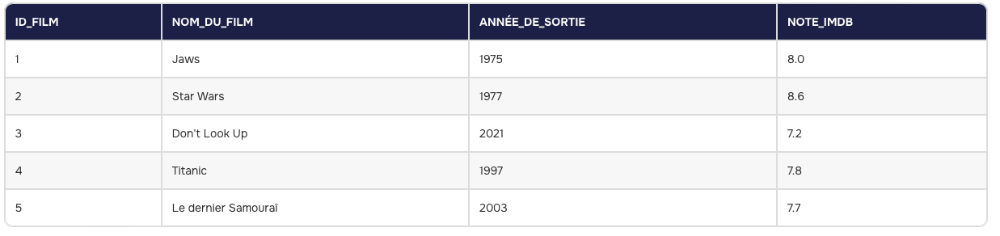
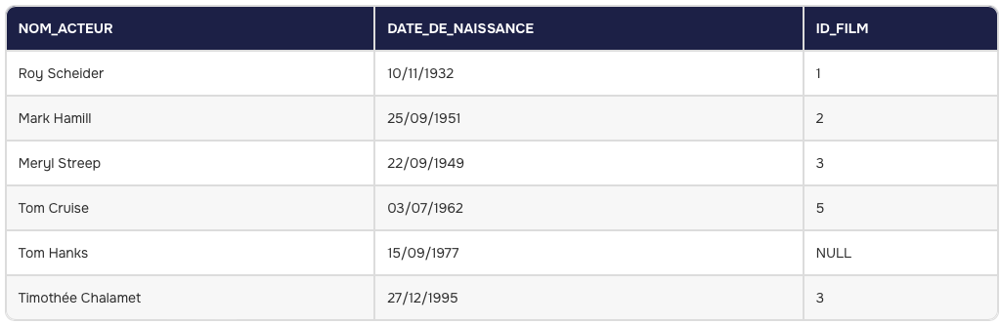
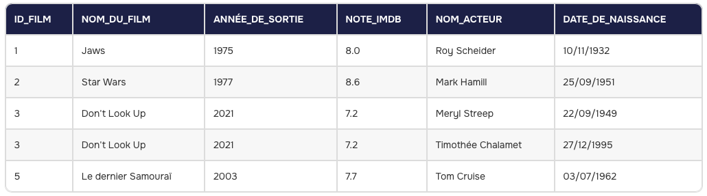

# Cheat Sheet : Setup PostgreSQL
> **CTP BDD R207** — *Configuration pour le compte guest*

Ce guide vous accompagne dans l'installation et la configuration de PostgreSQL sur votre VM pour l'examen.

---

## 🛠 1. Configuration de la VM
*À effectuer avant le démarrage de la machine virtuelle.*

1. **Carte Réseau** : Accédez aux réglages de la VM > **Réseau**.
2. **Mode** : Sélectionnez **Accès par pont (Bridge)**.
3. **Interface** : Choisissez `eth0` (ou l'interface reliée au réseau de l'IUT).

---

## 2. Installation et Configuration Système
*Exécutez ces commandes dans votre terminal Linux.*

### Étape A : Installation
```bash
sudo apt update && sudo apt install -y postgresql postgresql-contrib
```

### Étape B : Configuration des accès
Nous allons passer de l'authentification `peer` à `scram-sha-256` pour autoriser la connexion par mot de passe.

#### 1. Éditer `pg_hba.conf`
```bash
sudo nano /etc/postgresql/14/main/pg_hba.conf
```
> [!IMPORTANT]
> **Modifiez la ligne suivante :**
> - ❌ `local   all             all                                     peer`
> - ✅ `local   all             all                                     scram-sha-256`
> 
> **Ajoutez cette ligne à la fin du fichier pour autoriser le réseau de l'IUT :**
> ```text
> host    all             all             172.31.0.0/16            scram-sha-256
> ```

#### 2. Éditer `postgresql.conf`
```bash
sudo nano /etc/postgresql/14/main/postgresql.conf
```
> [!TIP]
> Recherchez la ligne `listen_addresses` et modifiez-la :
> - ❌ `#listen_addresses = 'localhost'`
> - ✅ `listen_addresses = '*'`

#### 3. Redémarrer le service
```bash
sudo systemctl restart postgresql
```

---

## 3. Création de l'utilisateur et de la Base
> [!WARNING]
> Remplacez `votre_nom` par votre login (ex: `briac_lemeillat`).

```bash
# Création de l'utilisateur et de la base (mot de passe : bdrt00)
sudo -i -u postgres psql -c "CREATE USER votre_nom WITH PASSWORD 'bdrt00';"
sudo -i -u postgres psql -c "CREATE DATABASE votre_nom OWNER votre_nom;"
```

---

## 4. Initialisation du Schéma
Connectez-vous à votre base pour finaliser la configuration :

```bash
psql -U votre_nom -d votre_nom -W
# Entrez le mot de passe : bdrt00
```

Une fois connecté au prompt `votre_nom=>`, exécutez :

```sql
-- Création du schéma obligatoire
CREATE SCHEMA votre_nom;

-- Définition du chemin de recherche par défaut
SET search_path TO votre_nom;
```

---

✅ **C'est prêt !**
Vous pouvez maintenant créer vos tables, elles seront directement rangées dans votre schéma personnel.

## Rappel des Méta-commandes utiles

```sql
\d -- Lister vos tables.
\d nom_table -- Voir la structure d'une table.
SHOW search_path; -- Vérifier que vous êtes bien dans votre schéma.
\q -- Quitter psql.
```

---

## 💡 C'est quoi le SQL ?

### 🏰 Un peu d'histoire
Le **SQL** (*Structured Query Language*) est né dans les années 70 chez **IBM**. À l'époque, les ordinateurs commençaient à stocker énormément de données, mais c'était un bazar sans nom pour retrouver une information précise. Deux chercheurs, Donald Chamberlin et Raymond Boyce, ont alors créé un langage qui ressemble à l'anglais pour "interroger" les machines.

### 📚 La vulgarisation : Le Bibliothécaire Magique
Imagine que ta base de données est une **immense bibliothèque** contenant des millions de livres, mais rangés dans un ordre que toi seul ne peux pas comprendre.

*   **La Base de Données**, c'est le bâtiment (la bibliothèque).
*   **Le SQL**, c'est le **Bibliothécaire**.

Tu ne vas pas fouiller dans les rayons toi-même (ce serait trop long et risqué). À la place, tu écris une petite note (une **Requête**) au bibliothécaire :
> *"S'il te plaît, donne-moi le nom de tous les auteurs qui ont écrit des livres de science-fiction entre 1950 et 1980."*

Le bibliothécaire (SQL) court dans les rayons, fait le tri, et te ramène exactement ce que tu as demandé sur un plateau.

### 🌍 Un langage universel
L'avantage du SQL, c'est qu'il est **standard**. Que tu travailles sur **PostgreSQL** (à l'IUT), **MySQL** (pour ton site web) ou **Oracle** (en grande entreprise), le langage reste quasiment le même. C'est comme parler une langue universelle que tous les serveurs de données du monde comprennent.

---


## 🔍 1. Les Bases (Sélection et Filtres)
C'est le **"Ping" du SQL** : on vérifie ce qu'il y a dans une table.

*   **Tout afficher** : `SELECT * FROM table;`
*   **Colonnes spécifiques (Projection)** : `SELECT nom, prenom FROM auteur;`
*   **Renommer une colonne** : `SELECT resume AS description FROM oeuvre;`
*   **Filtrer avec une condition** : `SELECT * FROM auteur WHERE ville = 'Arras';`
*   **Conditions multiples** : `WHERE année > 1960 AND année < 1970;`
*   **Recherche partielle** : `WHERE titre LIKE 'Le%';` *(le `%` remplace n'importe quels caractères)*.

---

## 📊 2. Organisation des données
Pour que les résultats soient exploitables (comme trier des logs).

*   **Trier** : `ORDER BY dateachat ASC;` *(ASC = croissant, DESC = décroissant)*.
*   **Limiter les résultats** : `LIMIT 10;`
*   **Pagination** : `LIMIT 10 OFFSET 10;` *(affiche du 11ème au 20ème)*.

---

## 🧮 3. Calculs et Fonctions d'Agrégat
Utile pour les statistiques (combien d'équipements, prix moyen...).

*   **Calcul direct** : `SELECT prix * 1.196 FROM exemplaire;`
*   **Compter les lignes** : `SELECT COUNT(*) FROM adherent;`
*   **Moyenne** : `SELECT AVG(prixachat) FROM exemplaire;`
*   **Calculer un âge** : `SELECT (2026 - anneenaissance) FROM auteur;`

---

## 🔗 4. Les Jointures
Une jointure sert à fusionner deux tables pour obtenir un nouveau dataset facile à exploiter.

### Exemple : Cinéma et Acteurs

**Table Cinema** : Chaque film a un `ID_film` unique.


**Table Acteurs** : L'`ID_film` est ici une **clé étrangère** qui permet de savoir dans quel film l'acteur a joué.


### L'INNER JOIN (La correspondance parfaite)
On réalise une jointure de type **INNER JOIN** pour associer les données uniquement quand l'ID_film est identique dans les deux tables.



**Structure de la requête :**
```sql
SELECT colonnes_1, colonnes_2, ...
FROM table1
INNER JOIN table2
ON table1.clé_commune = table2.clé_commune;
```

**Exemple concret :**
```sql
SELECT ID_film, Nom_du_film, Annee_de_sortie, Note_IMDB 
FROM Cinema 
INNER JOIN Acteurs 
ON Cinema.ID_film = Acteurs.ID_film;
```


---

## 💊 5. Cas Pratique : Gestion de Médicaments

### 3. Médicaments et leurs fabricants
Le nom du fabricant est dans la table `fabricant`, mais le nom du médicament est dans `medicament`. On les lie grâce à l'identifiant du fabricant.

```sql
SELECT medicament.nom_medoc, fabricant.nom_fabricant
FROM medicament
JOIN fabricant ON medicament.id_fabricant = fabricant.id_fabricant;
```

---

## 🛡️ 6. Les Filtres Avancés (WHERE)

### 4. Filtrer par pays (Belgique)
```sql
SELECT nom_medoc 
FROM medicament 
JOIN fabricant ON medicament.id_fabricant = fabricant.id_fabricant
WHERE pays = 'Belgique';
```

### 5. Recherche textuelle (Les sirops)
> [!TIP]
> On utilise **`LIKE`** pour chercher un mot dans une phrase. Le `%` veut dire "n'importe quoi avant ou après".

```sql
SELECT nom_medoc 
FROM medicament 
WHERE forme LIKE '%sirop%';
```

---

## 🧬 7. Jointures Multiples (Le niveau supérieur)

### 6. Trouver les médicaments par molécule (Diosmectite)
Ici, on doit passer par une table de liaison (`composer`) pour relier les médicaments aux molécules.

```sql
SELECT nom_medoc 
FROM medicament
JOIN composer ON medicament.id_medoc = composer.id_medoc
JOIN molecule ON composer.id_molecule = molecule.id_molecule
WHERE nom_molecule = 'diosmectite';
```

### 7. Fabricants utilisant une molécule spécifique
```sql
SELECT DISTINCT f.nom_fabriquant 
FROM fabriquant f
JOIN medicament m ON f.num_fabriquant = m.num_fabriquant
JOIN est_compose_de c ON m.nom_medic = c.nom_medic
JOIN molecule mol ON c.num_molecule = mol.num_molecule
WHERE mol.nom_molecule = 'diosmectite';
```

---

## 📦 8. Gestion des Stocks et Services

### 8. Sorties pour le service de Chirurgie
```sql
SELECT m.nom_medic, s.quantite 
FROM mouvement_stock s 
JOIN service serv ON s.code_service = serv.code_service
WHERE serv.nom_service = 'Chirurgie';
```

### 9. Historique des mouvements (trié par date)
```sql
SELECT * FROM mouvement_stock 
ORDER BY date_mouvement;
```

### 10. Catalogue complet (Alphabétique + Détails)
```sql
SELECT m.nom_medic, mol.nom_molecule, c.concentration, c.unite
FROM medicament m
JOIN est_compose_de c ON m.nom_medic = c.nom_medic
JOIN molecule mol ON c.num_molecule = mol.num_molecule
ORDER BY m.nom_medic ASC;
```

---

## 📈 9. Statistiques (Agrégats)

### 11. Nombre total de services
```sql
SELECT COUNT(*) FROM service;
```

### 12. Prix moyen des médicaments
```sql
SELECT AVG(prix) FROM medicament;
```

### 13. Records de prix (Max et Min)
```sql
SELECT MAX(prix) AS prix_max, MIN(prix) AS prix_min 
FROM medicament;
```